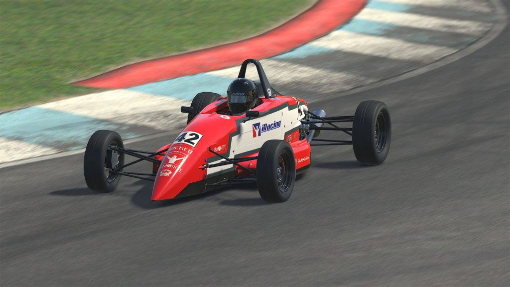

# Ray FF1600 – Momentum Apprentice

Ray Race Cars has been the quiet workhorse of Formula Ford since the late 1970s, building lithe, no-nonsense chassis for drivers who want to **learn to drive**, not just manage downforce.<a href="https://en.wikipedia.org/wiki/Ray_Race_Cars">Ray Race Cars — Wikipedia</a>

The GRS-1600, launched in 2012, is a modern echo of the classic Formula Ford recipe: Kent engine up back, skinny tires, subtle aero tweaks, and a stiffer safety cell so you can lean on the thing without flinching.<a href="https://www.rayracecar.com/">Ray FF1600 (Formula Ford)</a> iRacing's <a href="https://www.iracing.com/cars/ray-ff1600/">Ray FF1600</a> brings that same attitude: open cockpit, no wings, 116 hp, and absolutely nowhere to hide if your inputs are messy.

This is not a power car. It's a momentum apprenticeship on four wheels.

- [Garage 61 Car Page](https://garage61.net/app/cars/147)

---

## Technical Specifications (iRacing)

### Engine & Drivetrain

| Spec              | Value                                      |
| ----------------- | ------------------------------------------ |
| **Engine**        | Ford Kent 1600 "Crossflow" inline-4        |
| **Displacement**  | 1,599 cc (1.6L)                            |
| **Bore × Stroke** | 81.0 mm × 77.62 mm                         |
| **Power**         | 116 hp (85.3 kW) @ ~6,500 RPM              |
| **Aspiration**    | Naturally aspirated (Weber 32/36 DGV carb) |
| **Gearbox**       | Hewland LD200 4-speed H-pattern            |
| **Differential**  | Open (no LSD)                              |
| **Drive**         | Mid-engine, rear-wheel drive               |

### Chassis & Body

| Spec              | Value                             |
| ----------------- | --------------------------------- |
| **Chassis**       | Tubular steel space frame         |
| **Weight**        | 504 kg (1,111 lbs) with driver    |
| **Fuel capacity** | 21.96 L (5.8 gal / ~22 kg full)   |
| **Cooling**       | Twin side-mounted water radiators |
| **Aerodynamics**  | None (no wings, no ground effect) |
| **Cockpit**       | Open                              |

### Wheels & Tires

| Spec           | Value                      |
| -------------- | -------------------------- |
| **Wheel size** | 13" × 5.5" steel           |
| **Tires**      | Avon (treaded, not slicks) |
| **Front**      | ~185/60R13                 |
| **Rear**       | ~205/60R13                 |

### Brakes & Suspension

| Spec           | Value                        |
| -------------- | ---------------------------- |
| **Brakes**     | AP Racing calipers, no ABS   |
| **Suspension** | Double wishbone (adjustable) |
| **Driveshaft** | GKN assembly                 |

### Performance (approx.)

| Spec             | Value               |
| ---------------- | ------------------- |
| **Top speed**    | ~232 km/h (144 mph) |
| **0–100 km/h**   | ~6.0 seconds        |
| **Power/weight** | ~230 hp/tonne       |

### iRacing Features

| Feature          | Status           |
| ---------------- | ---------------- |
| **Rain capable** | ✅ Yes           |
| **AI enabled**   | ✅ Yes           |
| **Base content** | ✅ Included free |

---

## Character Notes

- **Momentum monarch** – With no aero to lean on, every kilometer per hour you carry into a corner is hard currency. The Ray loves early, confident throttle and one clean steering arc. Add steering angle instead of fixing entry speed and it just scrubs speed and sulks.
- **Weight-transfer whisperer** – There’s so little mass that any brake or throttle change shows up immediately. Stay on the brakes a fraction too long and the rear rotates with enthusiasm; pop off the pedal too quickly and the front goes light and washes away.
- **Draft-hungry** – On longer straights the car is a brick pushing air. Alone you feel slow; tucked in a tow it suddenly wakes up. Races are rarely about one hero overtake and more about living in the slipstream train without panicking.
- **Honesty machine** – If you overdrive it, it tells you right away. No dirty-band-aid traction control, no big wings to smooth out your mistakes. That can feel brutal at first, but it also means the car gives incredibly clear feedback when you get it right.

---

## Working With the Ray

1. **Brake bias as personality dial**  
   A conservative baseline bias around the low-50s keeps the rear calm while your hands and feet learn the choreography. As confidence grows you can nudge the bias rearward in small steps to help the car rotate into tighter corners. Think of bias not as “set and forget” but as a gentle personality slider between “stable” and “playful”.

2. **Steering discipline over hero hands**  
   The rack is quick; you don’t need big movements. Aim to turn the wheel once, smoothly, then hold. If you find yourself sawing at the wheel mid-corner, the problem is almost always entry speed or line choice, not “not enough steering”. In this car, extra angle equals extra lap time.

3. **Feeding the rear with throttle**  
   The easiest way to spin is to go from zero to full throttle in a single jab once you see the exit. Instead, let throttle be your balance tool: a little pedal mid-corner plants the rear tires and keeps the car “on its toes” without snapping. Full throttle should feel like a continuation of that, not a separate event.

4. **Kerb diplomacy**  
   The Ray will happily kiss flat kerbs; it hates sharp, high ones taken at weird angles. Whenever you approach a more aggressive kerb, think: “square it up or skip it.” Losing 1 km/h to go around is cheaper than bouncing the car and killing all your momentum.

5. **Racecraft mindset: play the long game**  
   In rookie splits the temptation is to send every gap. The Ray rewards the opposite: lifting early to keep your exit clean, thinking two corners ahead, and using draft to make low-risk passes. Defend when it matters, but most of the time it’s faster to breathe, let someone by if they’re desperate, and repass them with a calmer exit a lap later.

---

## Practice Ritual

- **Body check-in**  
  Start every session with two deliberately slow laps. Focus on breathing, seat position, and how lightly you can touch pedals and wheel while still being precise. Only when your hands and feet feel quiet, start pushing.
- **Corner-by-corner curiosity**  
  Instead of chasing lap time, pick one corner each stint and treat it as your lab. Try a slightly later apex, a different lift point, or a gentler brake release and notice what it does to minimum speed and exit feel.
- **Mini-reviews, often**  
  After a run, grab one replay moment: a clean lap, a near-save, a messy overtake. Watch it once from cockpit, once from TV cam, and name out loud what you did well before you critique what went wrong. The Ray will happily be your teacher if you let it.

---

## References

- [Ray Race Cars — Wikipedia](https://en.wikipedia.org/wiki/Ray_Race_Cars)
- [Ray GRS-1600 – Ray Race Cars](https://www.rayracecar.co.uk/grs1600)
- [Ray FF1600 — iRacing.com](https://www.iracing.com/cars/ray-ff1600/)
