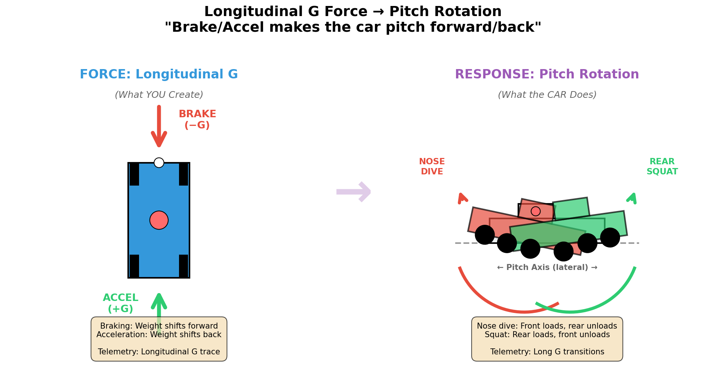
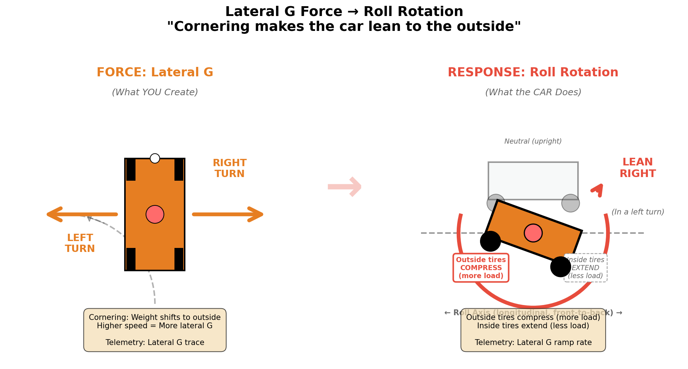
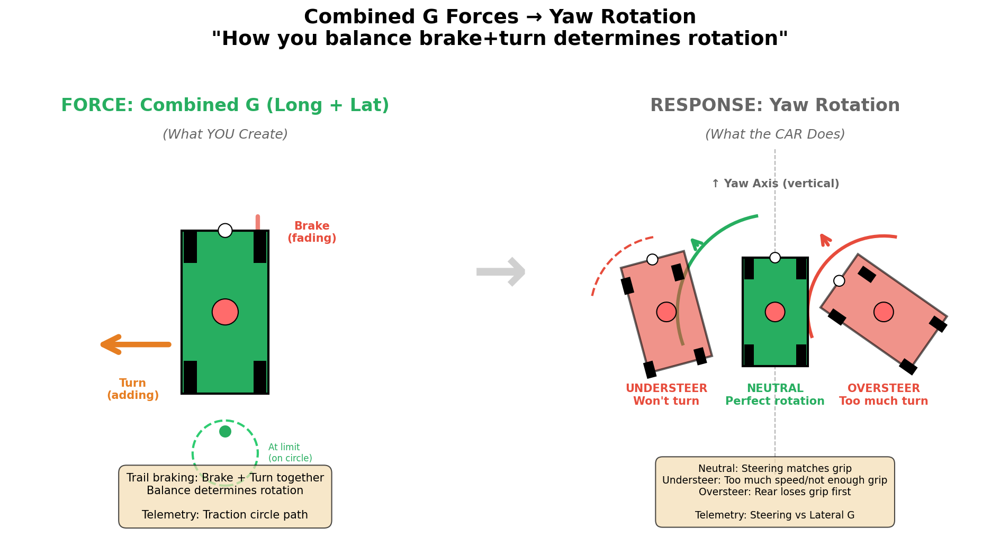

# Rotation & Balance: Understanding How the Car Moves

> **A practical guide to Roll, Pitch, and Yaw in the Ray FF1600**  
> _How to feel it, see it in data, and fix it_

---

## What This Guide Covers

This guide explains the **rotational movements** of your car:

- **Roll** - Leaning in corners (left/right)
- **Pitch** - Nose dive and squat (forward/backward)
- **Yaw** - Spinning/rotating (understeer/oversteer)

You already know about **weight transfer** (the forces that move load around). This guide is about **how the car rotates** when those forces are applied.

**Most importantly**: You'll learn how to **see rotation in your telemetry** so you can diagnose problems with data, not just feel.

---

## The 6 Degrees of Freedom (Simplified)

Every car can move in **6 ways**:

### 3 Linear Movements (Straight Lines)

1. **Longitudinal** - Forward/Backward (Acceleration/Braking)
2. **Lateral** - Side-to-Side (Cornering)
3. **Vertical** - Up/Down (Bumps, compression)

### 3 Rotational Movements (Spinning Around an Axis)

1. **Roll** - Rotation around front-to-back axis (body leans left/right in corners)
2. **Pitch** - Rotation around side-to-side axis (nose dives/squats)
3. **Yaw** - Rotation around vertical axis (car spins/rotates)

### Visual: Cause → Effect Relationships

Each force you create causes a specific rotation:

#### 1. Longitudinal G → Pitch



_**Left**: Braking/acceleration forces you create. **Right**: Nose dive/squat response. Your brake/throttle inputs cause the car to pitch forward/back._

#### 2. Lateral G → Roll



_**Left**: Cornering forces you create. **Right**: Body lean response. Your steering input causes the car to roll toward the outside._

#### 3. Combined G → Yaw



_**Left**: Mixed brake+turn forces. **Right**: Rotation response (understeer/neutral/oversteer). How you balance inputs determines if the car rotates correctly._

**Think of it this way:**

- **Weight transfer** = The FORCES (linear movements)
- **Rotation** = The CAR'S RESPONSE (rotational movements)

---

## Section 1: Roll (Body Lean in Corners)

### What It Is

**Roll** is when the car leans to one side during cornering. The outside suspension compresses, the inside suspension extends.

**What you feel:**

- Body tilting toward the outside of the corner
- More weight on the outside tires
- Car feels like it's "settling" into the corner

**In the FF1600:**

The FF1600 has relatively **soft suspension** and **narrow track width**, so you get noticeable body roll. This is NORMAL and actually helps you feel what the car is doing!

### How Roll Affects Grip

**Roll Stiffness Distribution** = How the car SHARES roll between front and rear:

- **Stiffer front** = Front rolls LESS, rear rolls MORE = Front loses grip first = **Understeer**
- **Stiffer rear** = Rear rolls LESS, front rolls MORE = Rear loses grip first = **Oversteer**
- **Balanced** = Front and rear roll together = **Neutral handling**

### How to See Roll in Telemetry

**Lateral G-Force Trace:**

```
Lateral G (entering left turn):
     ___/‾‾‾‾‾‾\___
    /            \
   /              \
  ↑               ↑
Roll starts    Roll stabilized
(initial lean) (settled in corner)
```

**What to look for:**

1. **Roll rate** = How FAST lateral G builds up

   - Smooth ramp = Progressive roll (good)
   - Spike = Abrupt roll (bad - unsettles car)

2. **Roll gradient** = The "ramp up" portion
   - Gradual = Comfortable, predictable
   - Sharp = Sudden, can cause instability

**Example from your data:**

```
Good roll (smooth):
Lat G:  0.2 → 0.5 → 0.8 → 1.0 → 1.0 (over 0.5 seconds)

Bad roll (jerky):
Lat G:  0.1 → 0.3 → 1.2 → 0.9 → 1.0 (spike and oscillation)
```

### Common Roll Problems

#### Problem: "Car feels vague on turn-in"

**Telemetry signature:**

- Lateral G builds SLOWLY (gradual ramp over 1+ seconds)
- Long delay between steering input and G response

**Translation:** Too much roll compliance - car is wallowing, taking time to settle

---

#### Problem: "Car feels nervous and darty"

**Telemetry signature:**

- Lateral G spikes immediately (sharp ramp in < 0.2 seconds)
- Oscillations in lateral G trace (wavy line)

**Translation:** Too little roll compliance - car transfers weight abruptly

---

## Section 2: Pitch (Nose Dive and Squat)

### What It Is

**Pitch** is when the front of the car dips down (nose dive) or the rear squats down.

**What you feel:**

- **Braking** = Nose dive, pushed forward into harness, front compresses
- **Acceleration** = Squat, pushed back into seat, rear compresses
- **Over crest** = Lightness (vertical unloading)

### How Pitch Affects Balance

**Pitch changes your grip balance:**

- **Nose dive (braking)** = Front tires load up (MORE front grip)
- **Squat (acceleration)** = Rear tires load up (MORE rear grip)

**This is WHY trail braking works!** You keep some brake pressure to keep the nose loaded (front grip) while you add steering.

### How to See Pitch in Telemetry

**Longitudinal G-Force Trace:**

```
Braking into corner (pitch forward):

Long G:  ___/‾‾‾‾\___
            ↑    ↑
         Brake  Release
         (dive) (recover)

Speed:   ‾‾‾\___/‾‾‾
            ↑    ↑
          Slow  Accel
```

**What to look for:**

1. **Pitch rate** = How fast longitudinal G changes

   - Smooth = Stable platform
   - Jerky = Car pitching back and forth (unstable)

2. **Pitch transition** = The moment you go from brake → throttle
   - Smooth zero-crossing = Good balance
   - Gap or spike = Car pitching (front/rear bouncing)

**Example: Good vs Bad Pitch Control**

```
GOOD (smooth pitch transition):
Long G:  Brake ‾‾\___/‾‾ Accel
Speed:         \___/
                ↑
            Smooth minimum

BAD (abrupt pitch change):
Long G:  Brake ‾‾|___/‾‾ Accel
Speed:         \__/‾
                ↑ ↑
            Dip + Pitch bounce
```

### Common Pitch Problems

#### Problem: "Car won't rotate on entry"

**Telemetry signature:**

- Long G goes to zero (no braking) BEFORE lateral G starts
- Speed drops to minimum, THEN you turn

**Translation:** You released brake too early - nose lifted, front unloaded, front grip lost

**Fix:** Trail brake longer - keep longitudinal G negative while lateral G builds

---

#### Problem: "Rear feels unstable mid-corner"

**Telemetry signature:**

- Long G goes from negative (brake) to positive (throttle) very quickly
- Speed minimum happens DURING lateral G peak

**Translation:** Too much pitch change mid-corner - car rocking forward/back, destabilizing rear

**Fix:** Add a "coast phase" between brake and throttle - let pitch settle

---

## Section 3: Yaw (Rotation / Spinning)

### What It Is

**Yaw** is rotation around the vertical axis. This is the car TURNING - or spinning if you overdrive!

**What you feel:**

- **Good yaw** = Car rotates smoothly toward apex (neutral)
- **Understeer** = Front won't turn, car pushes wide, steering feels heavy
- **Oversteer** = Rear comes around, car rotates too much, need counter-steer

### The Balance: Understeer vs Oversteer vs Neutral

```
UNDERSTEER (front slides first):
   Apex →  ●
           ↑
          ╱ Want to go here
         ╱
    ___╱
   ╱ Car goes here (wide)

OVERSTEER (rear slides first):
   Apex →  ●
          ╱ ↖
         ╱   ╲ Rear swings out
    ___╱     ╲
               ╲

NEUTRAL (balanced):
   Apex →  ●
          ╱
         ╱ Perfect arc
    ___╱
```

### How to See Yaw in Telemetry

This is the **most important** section for diagnosing handling problems!

#### Signature #1: Understeer

**Steering angle is HIGH, lateral G is LOW**

```
Corner entry:

Steering:  ___/‾‾‾‾‾‾‾‾\___  (30 degrees)
Lat G:     __/‾‾\__________  (0.8G - should be higher!)
Speed:     ‾‾\___/‾‾‾‾‾‾‾‾  (scrubbing speed)
           ↑
        Pushing wide - front sliding
```

**What this means:**

- You're asking for more turn (high steering angle)
- But the front tires can't deliver it (low lateral G)
- Car goes wide, you add MORE steering (doesn't help!)
- Speed scrubs off (sliding tires are slow)

**What you feel:** "The car won't turn! I'm adding steering but nothing happens!"

---

#### Signature #2: Oversteer

**Steering angle REVERSES (counter-steering), speed drops suddenly**

```
Mid-corner:

Steering:  __/‾‾‾\        (turn in)
              /‾‾‾\___     (counter-steer!)
Lat G:     _/‾‾‾‾‾‾‾\___  (high, then drops)
Speed:     ‾\____/‾‾‾‾‾   (sudden drop)
           ↑     ↑
        Rotate  Catch slide
```

**What this means:**

- Rear tires broke loose
- Car rotated too much (yaw rate too high)
- You counter-steered to catch it
- Speed dropped from sliding

**What you feel:** "Oh shit, rear stepped out!"

---

#### Signature #3: Neutral (The Goal!)

**Steering input matches lateral G output perfectly**

```
Perfect corner:

Steering:  __/‾‾‾‾‾\___   (smooth arc)
Lat G:     __/‾‾‾‾‾\___   (follows steering)
Speed:     ‾\___/‾‾‾‾‾‾   (smooth minimum)
           ↑   ↑
        Turn Apex
```

**What this means:**

- Car rotates exactly as much as you ask
- No understeer (car turns freely)
- No oversteer (rear stays planted)
- Speed trace is smooth (no sliding)

**What you feel:** "The car just FLOWS through the corner."

---

### Advanced: Yaw Rate Analysis

**Yaw rate** = How fast the car is rotating (degrees per second)

You can estimate yaw rate from steering angle changes:

```
Fast yaw (good rotation):
Steering: 0° → 20° → 30° → 20° → 0° (smooth progression)
Time:     0s   0.5s  1.0s  1.5s  2.0s

Slow yaw (understeer):
Steering: 0° → 30° → 35° → 40° → 35° (keeps increasing!)
Time:     0s   0.5s  1.0s  1.5s  2.0s
          ↑                    ↑
       Not turning         Adding more steering
```

**If steering angle keeps INCREASING mid-corner, you have understeer.**

---

## Section 4: How to Diagnose Handling from Telemetry

### The 3-Trace Method

Put these three traces on top of each other:

1. **Steering Angle** (your input)
2. **Lateral G** (car's response)
3. **Speed** (result)

```
Example: Good corner

Steering:  ___/‾‾‾‾‾\___
Lat G:     __/‾‾‾‾‾‾\___  ← Follows steering closely
Speed:     ‾\____/‾‾‾‾‾‾  ← Smooth minimum
```

### Diagnostic Chart

| Symptom       | Steering           | Lat G             | Speed          | Problem             |
| :------------ | :----------------- | :---------------- | :------------- | :------------------ |
| Understeer    | High, increasing   | Low, plateaus     | Scrubbing      | Front sliding       |
| Oversteer     | Reverses (counter) | Spikes then drops | Sudden drop    | Rear sliding        |
| Good rotation | Smooth arc         | Matches steering  | Smooth minimum | Neutral!            |
| Late turn-in  | Delayed ramp       | Delayed ramp      | Early minimum  | Braking too long    |
| Slow hands    | Gradual, slow ramp | Follows slowly    | Scrubbing      | Not decisive enough |

---

## Section 5: FF1600-Specific Rotation Characteristics

### Natural Understeer on Entry

The FF1600 has a **front-engine, rear-drive** layout with most weight on the front.

**Result:** Natural understeer on corner entry (front tires overloaded).

**Why you trail brake:** To use rear braking force to rotate the car and balance the front load.

### Lift-Off Oversteer

**What happens:** If you lift throttle mid-corner in a fast corner, the rear can step out.

**Telemetry signature:**

```
Mid-corner lift:

Throttle:  ‾‾‾‾\___/‾‾‾   (lift off suddenly)
Lat G:     _/‾‾‾‾‾‾‾\__   (momentary spike as rear unloads)
Steering:    /‾‾‾\        (counter-steer needed)
           ↑     ↑
        Lift  Rear steps out
```

**Fix:** Either stay committed on throttle OR lift progressively.

### Power-On Characteristics

With only 116 hp and treaded tires, the FF1600 rarely has power oversteer.

**BUT:** On cold tires or over crests (reduced vertical load), you can spin the rears.

**Telemetry signature:**

```
Cold tire spin (your L1-L2 at Winton T11!):

Throttle:  ____/‾‾‾‾‾‾‾   (applying power)
Speed:     __/‾‾‾\_____   (sudden dip - wheel spin!)
Long G:    __/‾\_______   (spike as tires break loose)
           ↑
        Wheel spin = lost time
```

---

## Section 6: Common Rotation Problems & Fixes

### Problem 1: "Car pushes wide at apex"

**Telemetry shows:**

- High steering angle (30-40°)
- Low lateral G (< 1.0G)
- Speed scrubbing off
- Steering angle INCREASING mid-corner

**Diagnosis:** Understeer

**Possible causes:**

1. **Released brake too early** → Front unloaded → No front grip
2. **Too much speed** → Front tires overloaded → Sliding
3. **Not enough trail braking** → Car not rotating → Front can't turn

**Fixes:**

1. Trail brake 0.2 seconds longer - keep front loaded
2. Brake 10m earlier - reduce speed 2-3 km/h
3. Add more steering earlier (before apex, not at apex)

---

### Problem 2: "Rear feels loose/nervous"

**Telemetry shows:**

- Steering has small counter-steer corrections
- Lateral G has small oscillations (wavy)
- Speed has micro-dips

**Diagnosis:** Oversteer (or near-limit instability)

**Possible causes:**

1. **Too much trail braking** → Rear too light → Rear sliding
2. **Too abrupt throttle** → Weight shifts suddenly → Rear steps out
3. **Over driving** → At/beyond limit → Rear breaking loose

**Fixes:**

1. Release brake 0.1 seconds earlier - let rear settle
2. Progressive throttle - ramp it on smoothly
3. Reduce speed or steering input - back off 5%

---

### Problem 3: "Car won't rotate on entry"

**Telemetry shows:**

- Steering applied early
- Lateral G builds SLOWLY
- Long G goes to zero (coasting or accelerating)
- Speed minimum happens EARLY (before apex)

**Diagnosis:** Not enough rotation (understeering entry)

**Possible causes:**

1. **Released brake too early** → No weight on front → No rotation
2. **Accelerating too early** → Rear loaded, front unloaded → Won't turn
3. **Steering too early** → Scrubbing speed → Can't rotate

**Fixes:**

1. Trail brake deeper - keep brake on longer
2. Add a coast phase - pause between brake and throttle
3. Turn later - apex later, straighter exit

---

### Problem 4: "Fast corners feel unstable"

**Telemetry shows:**

- High sustained lateral G (> 1.2G)
- Steering has small corrections (oscillating)
- Throttle modulation (lifting and reapplying)

**Diagnosis:** At the limit, fighting it

**Possible causes:**

1. **Too much steering input** → Over-driving → Tire sliding
2. **Not smooth enough** → Upsetting balance → Fighting it
3. **Wrong line** → Not enough radius → Can't maintain speed

**Fixes:**

1. Reduce steering by 10-20% - trust the car
2. Smoother inputs - "slow hands" (as Eric Wong shows)
3. Widen line - more radius = less steering needed

---

## Section 7: Tools to Analyze Rotation

### Using Little Padawan's Tools

#### Compare Telemetry Tool

Compare your lap vs a reference to see rotation differences:

```bash
uv run python tools/coach/compare_telemetry.py \
  "data/your_lap.csv" \
  "data/reference_lap.csv"
```

**Look for:**

- Steering angle differences
- Lateral G differences
- Counter-steering moments (oversteer)

#### Traction Circle Comparison

Shows if you're overdriving (outside circle) or underdriving (inside circle):

```bash
uv run python tools/coach/visualize_driver_traction_circle.py \
  "data/your_lap.csv" \
  "data/reference_lap.csv"
```

**Look for:**

- Spikes outside circle = sliding (too much yaw)
- Staying inside circle = not using all grip
- Smooth path on circle = perfect rotation

---

## Section 8: The "Feel" Dictionary

### What You Feel → What's Happening → What Data Shows

| You Feel               | What's Happening   | Telemetry Signature                       |
| :--------------------- | :----------------- | :---------------------------------------- |
| "Car won't turn"       | Understeer         | High steering, low lat G                  |
| "Rear stepped out"     | Oversteer          | Counter-steer in trace                    |
| "Car is nervous"       | At limit, unstable | Oscillations in steering/G                |
| "Flows through corner" | Neutral            | Steering matches lat G perfectly          |
| "Nose dives hard"      | Excessive pitch    | Spike in long G (braking)                 |
| "Car feels soft/vague" | Too much roll      | Slow lat G ramp up                        |
| "Car is darty"         | Too little roll    | Fast lat G spike                          |
| "Pushed into harness"  | Braking pitch      | Long G negative (up on traction circle)   |
| "Pushed back in seat"  | Accel pitch        | Long G negative (down on traction circle) |

---

## Section 9: Putting It All Together

### The 6 Movements in a Single Corner

Let's walk through a corner with ALL 6 degrees of freedom:

```
Corner approach → Entry → Apex → Exit

LINEAR MOVEMENTS:
- Longitudinal: Full accel → Brake → Coast → Accel
- Lateral: Straight → Turning left → Straight
- Vertical: Flat → Compression (braking) → Crest → Compression (accel)

ROTATIONAL MOVEMENTS:
- Roll: Upright → Lean left → Upright
- Pitch: Level → Nose dive → Level → Squat → Level
- Yaw: Straight → Rotate left → Straight
```

**In your telemetry:**

```
Brake zone → Turn-in → Apex → Exit

Long G:      ‾‾\___/‾‾  (pitch forward, then back)
Lat G:       __/‾‾‾\__  (roll left, then upright)
Steering:    __/‾‾‾\__  (yaw left, then straight)
Speed:       ‾\___/‾‾‾  (resultant)
```

**When it feels PERFECT:**

- All movements are SMOOTH
- No oscillations or corrections
- Speed trace has smooth minimum
- You feel in control, not fighting it

**When something's wrong:**

- One trace has spikes or oscillations
- Steering doesn't match lateral G
- Speed scrubs or dips unexpectedly
- You're making corrections (counter-steering, throttle modulation)

---

## Summary: The Quick Reference

### Roll

- **What:** Body lean in corners
- **See it:** Lateral G ramp rate
- **Goal:** Smooth, progressive ramp

### Pitch

- **What:** Nose dive (brake) and squat (accel)
- **See it:** Longitudinal G transitions
- **Goal:** Smooth zero-crossing from brake → throttle

### Yaw

- **What:** Car rotation (understeer/oversteer)
- **See it:** Steering vs Lateral G relationship
- **Goal:** Steering matches lateral G perfectly

### The Golden Rule

**Smooth traces = Smooth rotation = Fast lap**

If your telemetry traces are smooth (no spikes, no oscillations), your rotation is good. If they're jagged, you're fighting the car.

---

## Practice Exercise: Diagnose Your Own Lap

1. Pick a session where the car felt "weird"
2. Load your telemetry CSV
3. Plot these 4 traces together:
   - Steering Angle
   - Lateral G
   - Longitudinal G
   - Speed
4. Look for:
   - Does steering match lateral G? (yaw check)
   - Is the brake → throttle transition smooth? (pitch check)
   - Does lateral G ramp smoothly? (roll check)
5. Compare to your fastest lap
6. Find the ONE thing that's different

**Little Padawan can help with this!** Just ask: "Analyze my telemetry for rotation problems."

### Quick Rotation Analysis Commands

**Analyze a single lap for rotation issues:**

```bash
# Put your telemetry CSV in data/ folder, then:
uv run python tools/coach/analyze_telemetry.py "data/your_lap.csv"
```

Little Padawan will automatically check for:

- Steering vs lateral G relationship (yaw issues)
- Longitudinal G transitions (pitch smoothness)
- Lateral G ramp rates (roll characteristics)
- Overdriving moments (exceeding grip limits)

**Compare your lap vs a reference for rotation differences:**

```bash
uv run python tools/coach/compare_telemetry.py \
  "data/your_lap.csv" \
  "data/reference_lap.csv"
```

**Visualize your traction circle to see overdriving:**

```bash
uv run python tools/coach/visualize_driver_traction_circle.py \
  "data/your_lap.csv"
```

**Compare two of YOUR laps to see rotation improvement:**

```bash
uv run python tools/coach/visualize_driver_traction_circle.py \
  "data/slow_lap.csv" \
  "data/fast_lap.csv"
```

This will show you:

- Where you're overdriving (outside the circle)
- Where you're smooth (on the circle)
- Rotation differences between laps
- Statistics on smoothness and efficiency

**Or just ask Little Padawan:**

> "Hey Little Wan, I have a new lap in data/. Can you check if I'm overdriving or if I have rotation problems?"

Little Padawan will:

1. Run the appropriate analysis
2. Read the telemetry signatures
3. Diagnose the rotation issues
4. Explain what you're seeing in data
5. Suggest specific fixes with corner locations

---

## Next Steps

Now that you understand rotation:

1. **Read:** [Weight Transfer Guide](weight-transfer-guide.md) - How FORCES cause rotation (the physics behind the movements)
2. **Read:** [Trail Braking Guide](trail-braking-technique-guide.md) - How to CONTROL rotation on entry (the technique to apply it)
3. **Practice:** Load your Winton telemetry and look for rotation signatures in the data
4. **Compare:** Run `compare_telemetry` vs Eric Wong - see how his rotation differs from yours

### The Complete Picture

**Weight Transfer Guide** → Teaches you the FORCES (longitudinal, lateral, vertical G)  
**Rotation Guide** (this one) → Teaches you the RESPONSES (roll, pitch, yaw)  
**Trail Braking Guide** → Teaches you the TECHNIQUE to manage both

**Master all three, and you'll understand:**

- WHY the car does what it does (physics)
- WHAT the car is doing (rotation analysis)
- HOW to make it do what you want (technique)

**The goal:** Not to think about all this while driving, but to DIAGNOSE problems after a session using telemetry and fix them with targeted practice.

---

## Appendix: The 6 Degrees of Freedom Summary

### 3 Linear (This creates FORCES - Weight Transfer Guide covers this)

| Movement     | Axis       | What You Feel        | Telemetry Trace   |
| :----------- | :--------- | :------------------- | :---------------- |
| Longitudinal | Front-Back | Forward/back in seat | Longitudinal G    |
| Lateral      | Side-Side  | Pushed left/right    | Lateral G         |
| Vertical     | Up-Down    | Bumps, compressions  | (Not in G61 data) |

### 3 Rotational (This is the RESPONSE - This guide covers this)

| Rotation | Around Axis  | What You Feel         | Telemetry Signature        |
| :------- | :----------- | :-------------------- | :------------------------- |
| Roll     | Longitudinal | Body leans in corners | Lateral G ramp rate        |
| Pitch    | Lateral      | Nose dive, squat      | Longitudinal G transitions |
| Yaw      | Vertical     | Car spins/rotates     | Steering vs Lateral G      |

**Together:** Forces create rotation. Managing forces controls rotation. Controlling rotation makes you fast.

---

_Master Lonn, you now have the full picture: Forces (weight transfer) + Rotation (this guide) + Technique (trail braking) = Complete understanding of car dynamics. Time to go drive! 🏎️💨_
