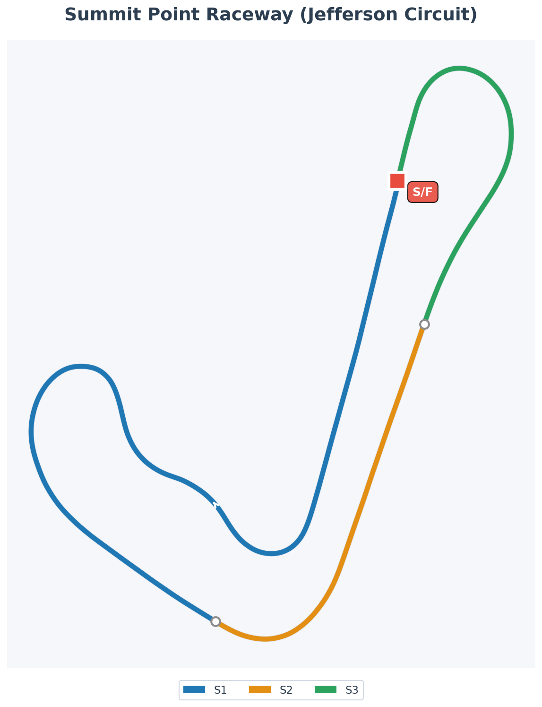

# Summit Point Jefferson Circuit – Confidence Gym

Jefferson Circuit is Summit Point’s purpose-built training ribbon, tucked into the West Virginia hills and opened in 1996 as a handling course for government agencies, security outfits and club drivers.<a href="https://en.wikipedia.org/wiki/Summit_Point_Motorsports_Park">Summit Point Motorsports Park — Wikipedia</a>

Where the Main Circuit chases speed and spectacle, Jefferson is all about teaching. The 1.1-mile loop strings together nine corners with barely a straight between them: constant-radius bends, linked transitions and a few sneaky crests that keep the car loaded almost the entire lap. It’s the kind of place instructors love for car-control days and HPDE weekends because it exposes sloppy hands and greedy feet in about three corners flat.

On paper it looks like a glorified kart track. In the car, it’s a **“no hiding, no resting”** test of rhythm. There’s just enough runoff to keep things sane, but not enough to let you be lazy.

- [Summit Point Jefferson Circuit – YouTube](https://youtu.be/gMIiUYakCFA?si=QzczDdshiz--UbIe)
- [MidfieldRacing219 Full Race in Rookie Fixed](https://www.youtube.com/watch?v=iMaqbIWLRxw)
- [Garage 61 Track Page](https://garage61.net/app/tracks/89)

## Track Map

## Sector Definitions (iRacing)

| Sector | Approx Time | Corners                        | Key Challenge                                 |
| ------ | ----------- | ------------------------------ | --------------------------------------------- |
| **S1** | ~28s (55%)  | T1-T3 complex → Downhill esses | Patience, smooth transitions, rhythm building |
| **S2** | ~11s (22%)  | T6 pinch point → tight left    | Brake discipline, rotation, early throttle    |
| **S3** | ~11s (22%)  | Carousel back section → Finish | Constant steering rate, momentum preservation |

> **Note:** S1 is the longest sector and contains the most technical sequence. If your S1 variance (σ) is high, focus on the T1-T3 link-up and esses flow.

---

## Character Notes

- **Handling course, not horsepower stage** – There’s nowhere to really stretch the engine. You’re almost always in second or third, working at the limit of grip rather than the limit of speed.
- **Constant weight transfer** – The opening off-camber left-right, the downhill esses and the carousel-style back section keep the chassis moving. You don’t plant the car and wait; you ride the weight shift.
- **Short lap, long exposure** – At only 1.1 miles, mistakes come back around quickly. Miss a reference, and you get to stare at it again 60 seconds later.
- **“Hands busy, eyes far”** – With trees, barriers and earth banks close to the edge, apexes often appear late. The track rewards drivers who can keep their hands doing small, precise things while their vision stays two corners ahead.

---

## Ray FF1600 at Jefferson

In the Ray FF1600, Jefferson is basically a **live-fire practice range** for everything the car does best: momentum, rotation off-brake, and smooth feet.

- **Opening complex (T1–T3)**  
  The first left-right asks for patience. In the Ray, brake a touch earlier than instincts scream, nibble at the entry curb and focus on placing the car so you can roll through T2 and T3 with minimal steering. Any jabby correction here costs you all the way into the esses.

- **Downhill esses**  
  The esses are where you learn to _breathe_ the throttle. Treat them like one long, snaking corner: a small lift to set the nose, then gentle reapplication of power as the Ray flows from one side to the other. If you find yourself making big steering changes mid-esse, you turned in too late or carried too much entry speed.

- **T6 pinch point**  
  The tight left in the back half is the lap’s main “I went in optimistic” corner. In the FF1600, use it as your braking-discipline classroom: straight-line brake, ease into the turn while bleeding off pressure, and get the car rotated early so you can pick up throttle sooner than feels natural. A slightly more rearward bias later in the week can help the nose bite here—if your brake release is smooth.

- **Carousel feel of the back section**  
  From the mid-lap on, Jefferson feels like a stretched carousel. The Ray loves being allowed to take one long arc through these corners. Focus on constant steering rate and steering _release_; if you’re un-winding the wheel gradually, your exit speeds will start to creep up without drama.

- **Brake bias & tyre temps**  
  Short straights mean tyres never get roasted, but also never fully rest. A safe baseline bias in the low-50s keeps the rear predictable while you learn the flow. As you get comfortable, a half-click rearward can help the car pivot into T6 and the tighter kinks—just remember that with low speeds, any rear lockup will be obvious and embarrassing.

---

## Practice Cues for the Week

Let Jefferson be your **“mechanics before heroics”** track in the Ray.

- **Micro-stints for link-up**  
  Start the week with short, focused runs of 8–10 laps where your only goal is to make T3–T6 feel like one connected piece of driving. Don’t chase time; chase laps where your steering inputs are small and you’re not stabbing at the throttle.

- **No-brake laps (within reason)**  
  Once you know the layout, try a slow session where you use as little brake as possible, relying on lifting and early turn-in to control speed. This exaggerates the Ray’s momentum nature and teaches you how much corner speed the car will actually carry when you’re not over-slowing everything.

- **Racecraft rehearsals**  
  There aren’t many true passing zones here, so practice using the short chute into T1 as your main overtaking classroom. Work on getting better exits from the final corners, then making _clear, early_ moves under braking—no late, hopeful lunges. In the FF1600, a clean drive off the last turn will beat a divebomb nine times out of ten.

Jefferson isn’t about glory laps; it’s about quietly sharpening the fundamentals. If you can be smooth, accurate and patient here, the Ray will feel easier everywhere else.

---

## Setup & Benchmarks

### Brake Bias Guidance

**Recommended Range:** 54-58%

- **56%**: Sweet spot for most drivers (stable + rotation)
- **57-58%**: More stable, better for bumpy conditions
- **54-55%**: More rotation, higher risk on bumpy patches

Start at 56% and adjust 0.5% at a time. If rear feels loose/snappy at T3 hairpin or T7 carousel, move forward. If car won't rotate, move rearward 0.2-0.3%.

### Lap Time Benchmarks

| Level                         | Time         | Notes                  |
| ----------------------------- | ------------ | ---------------------- |
| **Alien (Top 0.1%)**          | 0:49.300     | World-class            |
| **Fast Driver (Top 5%)**      | ~0:50.345    | Competitive veteran    |
| **Competitive (Rookie Goal)** | Sub-0:51.000 | Strong intermediate    |
| **Master Lonn Week 01 Final** | 0:51.186     | 1st Place Victory! 🏆  |
| **Master Lonn Week 01 Start** | ~0:56.000    | First session baseline |

> Master Lonn went from ~0:56 (first session) to **0:51.186** (race victory) in Week 01 - a **4.8s improvement**. From "what is this track?" to podium finish in 7 days. The learning method works.

---

## Corner-by-Corner Reference (Ray FF1600)

### Sector 1 (Opening Complex → Esses) [55% of lap]

| Corner | Type                    | Gear    | Target Min Speed           | Key Points                                                                                  |
| ------ | ----------------------- | ------- | -------------------------- | ------------------------------------------------------------------------------------------- |
| **T1** | Right 90°               | 2nd     | 37-40 mph (60-64 km/h)     | Brake ~70m after 100m board, light trail brake to late apex (2/3 into corner), protect exit |
| **T2** | Left Kink               | 4th     | 70-78 mph (113-126 km/h)   | No brake, small lift if needed, keep mid-right line for T3 setup                            |
| **T3** | **Tight Right Hairpin** | **2nd** | **28-31 mph (45-50 km/h)** | **CRITICAL - Brake from 100m board, long trail brake to very late apex, smooth throttle!**  |
| **T4** | Left on Back Straight   | 4th     | 87+ mph (140+ km/h)        | Flat out, brief acceleration zone                                                           |
| **T5** | Right of Esses          | 3rd     | 59-65 mph (95-105 km/h)    | Brush brake or lift, early-mid apex, minimal curb                                           |
| **T6** | Left of Esses           | 3rd     | 53-59 mph (85-95 km/h)     | Roll brake from T5, light trail brake, **exit sets up T7!**                                 |

### Sector 2 (Carousel Entry) [22% of lap]

| Corner | Type                    | Gear    | Target Min Speed           | Key Points                                                               |
| ------ | ----------------------- | ------- | -------------------------- | ------------------------------------------------------------------------ |
| **T7** | **Long Right Carousel** | **3rd** | **47-53 mph (76-85 km/h)** | **CRITICAL - Early brake, long trail brake to late apex, patience key!** |

### Sector 3 (Final Corners → Finish) [22% of lap]

| Corner  | Type                          | Gear    | Target Min Speed           | Key Points                                                                               |
| ------- | ----------------------------- | ------- | -------------------------- | ---------------------------------------------------------------------------------------- |
| **T8**  | Short Left                    | 3rd     | 50-56 mph (80-90 km/h)     | Light brake/lift, late apex, early but gentle throttle                                   |
| **T9**  | Left Setup for T10            | 3rd     | 43-50 mph (69-80 km/h)     | Small brake, light trail brake, late apex, keep mid-track                                |
| **T10** | **Final Right onto Straight** | **2nd** | **37-40 mph (60-64 km/h)** | **MOST CRITICAL EXIT - Brake 50-70m before apex, late/diamond apex, earliest throttle!** |

> **Three Critical Corners:** T10 (most important exit), T3 (second most important), T5-T6 esses (sets up carousel). Master these three and you have the lap.

---

## Personal Notes

> _First impressions and learnings. Worth revisiting next time I'm here._

### [Week 01 – December 2025](../weeks/week01/) (Pre-Season 2026S1 on iRacing)

**First Discovery:** Jefferson isn't a configuration of Summit Point – it's a completely separate 1.1-mile training track built on the same property in 1996. Purpose-built for car control, not racing spectacle.

**The Feel:** Fast, short, very kart-like. Constant corners, no real straights to rest. You're always working.

**The Reference Point Problem:** This track has almost no obvious brake markers – no boards, no grandstands, no clear curb changes. It's all trees, grass edges, and earth banks. Hard to judge when to brake, when to turn in, when to get back on throttle.

**The Dotted Line Solution:** Found myself using the dotted center line as my main reference – especially for the final corner onto the main straight. This feels more like a road than a race track. Maybe that's intentional for a "training" circuit? This might actually be more transferable to real-world driving than "brake at the 100m board."

**T1-Esses Sequence:** T1 is the hardest to judge. Not because of speed, but because it's not really one corner – it's a sequence that flows into T2, T3, and then the esses. If you get T1 wrong, everything downstream suffers. Still searching for a consistent turn-in reference.

**Rookie Prediction:** Expecting carnage in official races. No clear brake zones means inconsistent braking across the field. Cars will be bunched constantly because of the short lap. But the runoff is forgiving – probably lots of 4x tap-outs, fewer race-ending wrecks.

**Brake Bias:** Settled on **56.0%** – I tested in the range 57 - 54, where 54% was too pointy, made the rear too eager to rotate under braking.

**The Breakthrough:** Time came from filling the gaps between brake and throttle (coasting dropped from 12% to 1.7%), not from braking later or carrying more corner speed. The transitions are where the time lives.

### Overtaking

- **T1 inside:** Primary passing zone – need strong carousel exit for draft
- **T6 inside:** Secondary option – _if_ you have better carousel exit, inside opens up
- **Setup required:** Both passes come from the same place: carousel exit quality
- **Patience is mandatory:** Follow for 2 laps, learn their weakness, strike clean
- **The trap:** Forcing passes breaks rhythm. σ 3.21s (impatient) → σ 0.81s (patient) proved this

> _"I'm faster. I can wait."_

---

## References

- [Summit Point Motorsports Park — Wikipedia](https://en.wikipedia.org/wiki/Summit_Point_Motorsports_Park)
- [Summit Point Raceway — iRacing.com](https://www.iracing.com/tracks/summit-point-raceway/)
- [Summit Point Jefferson Circuit — Summit Point Motorsports Park](https://summitpointmp.com/jefferson-circuit/)
