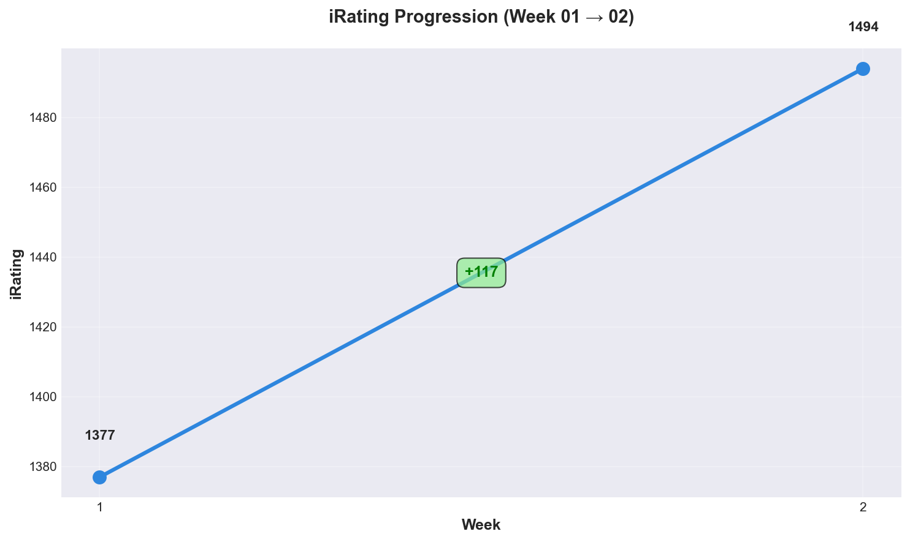
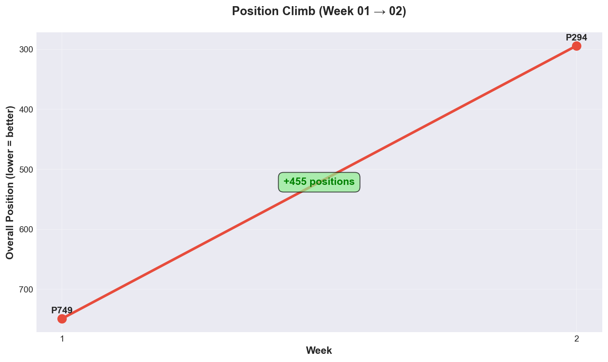
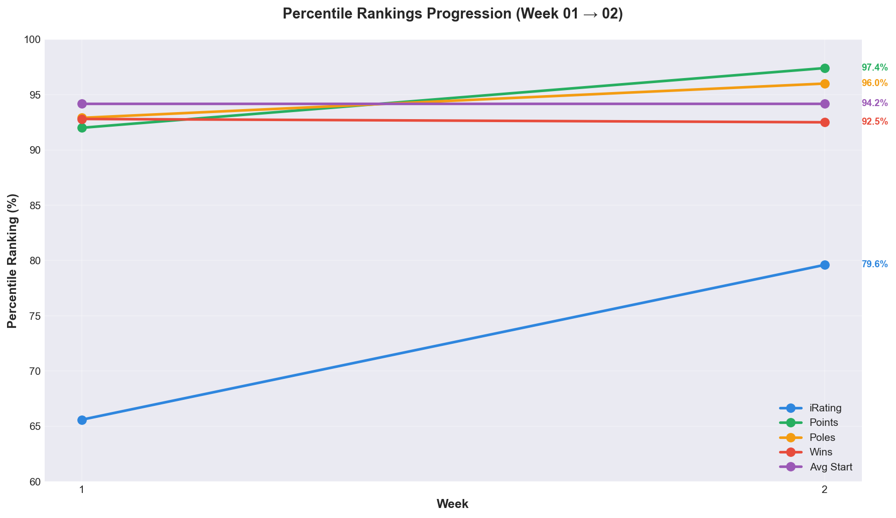

# Season Progression Report (Week 01 → Week 01)

**Generated:** 2025-12-22 16:05
**Weeks Analyzed:** 1

---

## 📈 Progression Summary

### 💬 Week 01: The Baseline

Master Lonn, this is your **starting point** for the season! 📏

Week 01 establishes your baseline metrics - think of this as "Day Zero" of your season progression tracking. Right now the charts show a single data point (you at 1377 iRating, Position 704), but as you add Week 02, 03, and beyond, these charts will come alive with trend lines, climbs, and momentum shifts!

**What you're looking at:** Your current standing after Jefferson (2 races, 1 win). From here, every week adds a new data point, and we'll watch your progression unfold in real-time! 📊✨

### iRating Journey



- **Starting iRating:** 1377
- **Current iRating:** 1377
- **Total Gain:** +0 points _(Week 01 baseline)_
- **Average per Week:** +0.0 points _(single week, no trend yet)_

**What this chart will show (Week 02+):** Your iRating climb week-over-week. We'll see if you're gaining consistently, accelerating, or plateauing. The trend line will tell the story of your season!

### Position Climb



- **Starting Position:** 704 _(out of 8,510 drivers!)_
- **Current Position:** 704
- **Positions Gained:** +0 _(Week 01 baseline)_

**Reading this chart:** Lower position = better = higher on the chart (Y-axis is inverted). The green shaded area shows how many drivers you're beating. Right now: **7,806 drivers** behind you! As you climb the standings, this green area will grow and we'll see your position number drop toward the elite top 100.

### Percentile Rankings



**Your Week 01 Percentiles:**
- 📊 **Points:** 92nd percentile (crushing it!)
- 🏆 **Wins:** 93rd percentile (elite!)
- 🏁 **Poles:** 93rd percentile (top qualifier!)
- ⭐ **iRating:** 66th percentile (will catch up!)

**What this chart tracks:** How you rank across 4 key metrics compared to ALL 8,510 drivers. Higher = better. The reference lines (50th, 75th, 90th percentile) show milestone tiers. Notice how your results (points/wins/poles at 92-93%) are WAY above your iRating (66%)? That gap will close as you race more - your rating will catch up to your performance!

---

## 📊 Week-by-Week Breakdown

### Week 01: Summit Point Jefferson Circuit 🏁

- **Position:** 704 / 8,510 (Top 8.3%)
- **iRating:** 1377 (+139 from starting 1238!)
- **Points:** 80.0 (92nd percentile ⭐)
- **Wins:** 1 (93rd percentile 🏆)
- **Starts:** 2 races
- **Incidents/Start:** 3.50 (53% cleaner than series avg!)

**Week 01 Story:** Your debut week! Started at 1238 iR, jumped to 1377 (+139) through 2 races at Jefferson. Scored your **first victory** and a pole position. Elite-level incident rate (3.5 vs series avg 7.44). Set the foundation for the season - now let's build on it! 🚀

---

### 💬 What These Visualizations Mean

**Single Week Data (Week 01):**
Right now you're seeing a snapshot - one data point representing where you are after Jefferson. Think of this as your "before" photo in a fitness transformation! 💪

**Coming Soon (Week 02+):**
Once you add Rudskogen data, these charts will show:
- **Trends:** Are you climbing steadily or in big jumps?
- **Momentum:** Accelerating improvement or plateauing?
- **Consistency:** Smooth progression or volatile swings?
- **Gaps:** Which metrics lag behind (needs focus)?

**How to Use Them:**
- Upload Week 02 standings after Rudskogen
- Run the progression tool again with both weeks
- Compare: Did you gain iRating? Climb positions? Improve percentiles?
- Identify patterns and set realistic goals based on YOUR actual trajectory

---

## 🎯 Next Steps

**After Week 02 (Rudskogen):**

1. **Download standings CSV** from iRacing
2. **Run the command:** `/analyze-standings-for-week 02`
3. **Generate updated visualizations:**
   ```bash
   uv run python tools/coach/visualize_standings_progression.py \
       data/standings/week01 \
       data/standings/week02
   ```
4. **Compare Week 01 → 02:**
   ```bash
   uv run python tools/coach/compare_weekly_standings.py \
       data/standings/week01/*.csv \
       data/standings/week02/*.csv \
       981717
   ```

Then these charts will show:
- iRating: 1377 → ??? (hoping for 1450+!)
- Position: 704 → ??? (target: < 600!)
- Percentiles: Track if gaps close or widen
- Momentum: See if Week 01's strong start continues!

**The season story unfolds one week at a time.** This is just Chapter 1! 📖🏁
