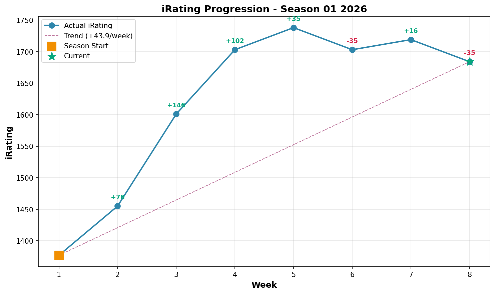
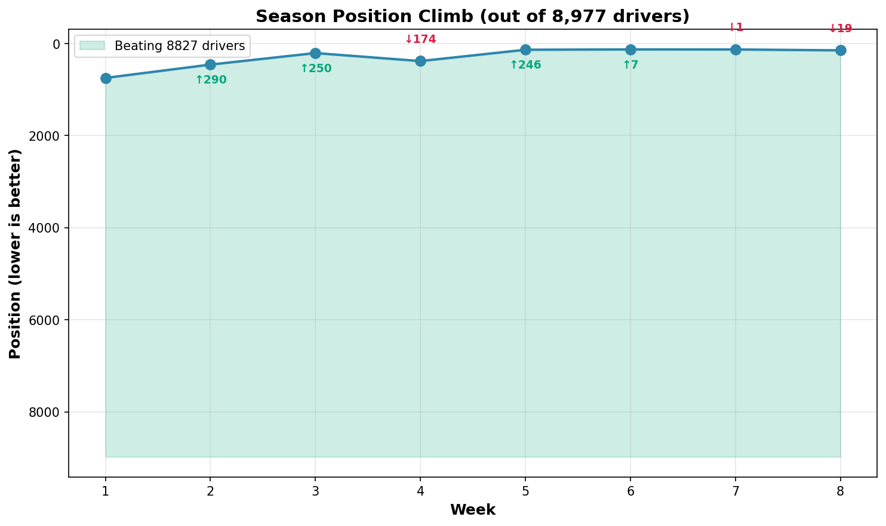
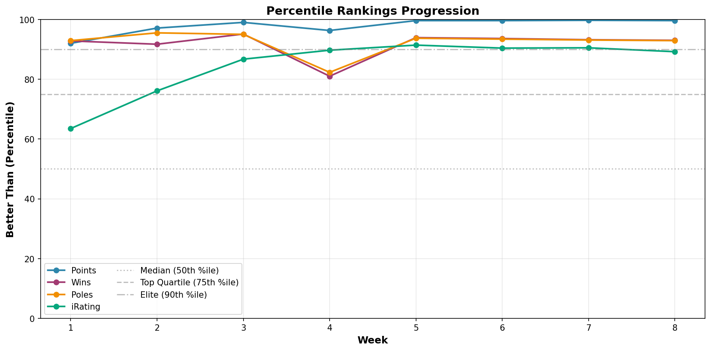

# Season Progression Report (Week 01 → Week 08)

**Generated:** 2026-02-09
**Weeks Analyzed:** 8
**Season:** 01 2026 - Formula 1600 Rookie Series

---

## 📈 Little Padawan's Progression Summary

Master Lonn. _unfurls the full season scroll_

Eight weeks. Twenty races. Forty thousand drivers.

Let's talk about what just happened.

You walked into Season 01 2026 with a starting iRating of **1238** and one mission: "Just do a whole series season for once. Just show up."

Eight weeks later? **iRating 1684** (+446). **Position 150** out of **40,437 drivers**. Top **0.37%**.

You didn't just show up. You showed _up_.

### The Journey At A Glance

- **Starting Point:** 1238 iRating, Division 8, nobody
- **Current:** 1684 iRating, P150/40,437, Top 0.37%, B-class license
- **Total Climb:** +446 iRating, 599+ positions gained
- **Season Rate:** +55.75 iRating/week average
- **Trajectory:** Two-phase — explosive climb (Weeks 01-05), then consolidation (Weeks 06-08)

The climb isn't a straight line anymore. And that's actually the interesting part.

---

## 📊 Visual Progression

### iRating Journey

The chart tells a clear two-act story.

**Act 1 (Weeks 01-05): The Ascent.** Five consecutive positive weeks. Every single track produced iRating gains: +139, +117, +107, +71, +66. The gains were decelerating (natural — you're facing tougher competition as you climb) but relentlessly positive. Peak: **1738** at the end of Week 05.

**Act 2 (Weeks 06-08): The Turbulence.** Three weeks, net result: -54 iRating. Week 06 (-35) taught racecraft. Week 07 (+16) recovered. Week 08 (-35) met competition reality at a popular track.

This is NOT regression. This is what happens when your iRating catches up to your skill level and you start facing drivers who are genuinely fast. The easy gains are over. Every point from here is earned.

**Key Observations:**
- Peak iRating (1738) was 7 weeks ago — longest period without a new peak
- Current 1684 is still +446 from starting 1238
- The 90th percentile line (1708) is only 24 points above you
- Two -35 dips in 3 weeks is a pattern, but the _causes_ differ (racecraft vs competition density)

### Position Climb

This chart is deceptive because the pool keeps growing. Context matters:

| Week | Position | Total Drivers | Top % |
|------|----------|---------------|-------|
| 01 | 749 | 8,977 | 8.3% |
| 02 | 459 | 15,787 | 2.9% |
| 03 | 209 | 21,567 | 1.0% |
| 04 | 383 | 10,096 | 3.8%* |
| 05 | 137 | 30,481 | 0.45% |
| 06 | 130 | 33,817 | 0.38% |
| 07 | 131 | 37,508 | 0.35% |
| **08** | **150** | **40,437** | **0.37%** |

_*Week 04 had a smaller pool snapshot — Lime Rock was less popular_

**The real story:** You went from Top 8.3% to Top 0.37%. That's a 22x improvement in percentile ranking. The position number (150) is higher than Week 07 (131), but the pool grew by 2,929 drivers. In percentage terms, you held the line.

**Positions Gained:** 599 since Week 01. That's **599 drivers** you've passed in the standings through pure performance.

**Drivers Beaten:** 40,287 out of 40,437 are behind you. You're ahead of 99.63% of the field.

### Percentile Rankings

Track your standing across multiple metrics week-over-week. The gap between your **Points percentile** (99.6%) and **iRating percentile** (89.2%) remains the biggest story — a 10.4-point gap where your results consistently outperform your rating.

**What this means:** The math says your iRating should be higher based on your results. It'll catch up. It always does.

---

## 📅 Week-by-Week Breakdown

### Week 01: Summit Point Jefferson

- **Position:** 749 / 8,977 (Top 8.3%)
- **iRating:** 1377 (+139 from 1238)
- **Points:** 80.0
- **Wins:** 1 | **Starts:** 2 | **Incidents/Race:** 3.50

**Week Story:**
The beginning. Two races, one win. Flow state discovered for the first time. The session where Master Lonn said "the car was driving itself" and the data showed his fastest laps correlated with relaxed inputs. A seed was planted: _trust the car, don't fight it._

---

### Week 02: Rudskogen Motorsenter

- **Position:** 459 / 15,787 (Top 2.9%)
- **iRating:** 1494 (+117)
- **Points:** 148.0
- **Wins:** 1 | **Starts:** 6 | **Incidents/Race:** 2.67

**Week Story:**
Sector mastery began here. The "Angst Hill" that scared him on Day 1 became a strength by Day 5. Beat his July PB by 0.461s. First pole position. "Position Secured" was born as a racecraft concept — secure what you have before attacking. Volume increased from 2 to 6 starts. Commitment to the season solidified.

---

### Week 03: Winton Motor Raceway

- **Position:** 209 / 21,567 (Top 1.0%)
- **iRating:** 1601 (+107)
- **Points:** 235.0
- **Wins:** 2 | **Starts:** 8 | **Incidents/Race:** 2.00

**Week Story:**
Consistency unlocked. The "boring win" — so dominant it felt routine. Crossed 1600 iRating. Incident rate dropped to 2.00 (season best at that point). Winton's flowing layout matched his driving style. The first week where technique felt _automatic_. Broke into Top 1% of the field.

---

### Week 04: Lime Rock Park

- **Position:** 383 / 10,096 (Top 3.8%)
- **iRating:** 1672 (+71)
- **Points:** 94.0 (1 start only)
- **Wins:** 0 | **Starts:** 1 | **Incidents/Race:** 0.00

**Week Story:**
Only one official race, but what a race. Top split podium (**P3**) in SoF 2035 — his highest competition at that point. Faster than the series #1 driver through Turn 5. Studied telemetry against alien drivers and found real, actionable gaps. Zero incidents. The Diving Turn became his signature corner. Proved he belongs in higher splits.

---

### Week 05: Motorsport Arena Oschersleben GP

- **Position:** 137 / 30,481 (Top 0.45%)
- **iRating:** 1738 (+66) — **PEAK iRATING**
- **Points:** 397.0
- **Wins:** 2 | **Starts:** 11 | **Incidents/Race:** 1.91

**Week Story:**
The golden week. Peak iRating (1738). Incident rate at season-low (1.91). The T2 Hotel Exit technique was solved — a specific, data-backed fix that unlocked consistent speed. Volume peaked at 11 starts. P3 among Dutch drivers. Everything was clicking. The "Hotel Rule" (know when to stop racing for the day) was formalized.

---

### Week 06: Oran Park Raceway GP

- **Position:** 130 / 33,817 (Top 0.38%)
- **iRating:** 1703 (-35) — **FIRST DIP**
- **Points:** 464.0
- **Wins:** 2 | **Starts:** 15 | **Incidents/Race:** 2.80

**Week Story:**
The wake-up call. First negative iRating week. Racecraft mistakes — driving INTO contact situations instead of managing space. Sequential corner mastery was the technical win, but the racing lesson was harder: "know when to stop" became personal when fatigue-racing cost real iRating. Incidents crept up from 1.91 to 2.80/race. Position actually improved (137→130) thanks to continued points accumulation, but the iRating told the truth.

---

### Week 07: Summit Point Main Circuit

- **Position:** 131 / 37,508 (Top 0.35%)
- **iRating:** 1719 (+16) — **RECOVERY**
- **Points:** 540.0
- **Wins:** 2 | **Starts:** 17 | **Incidents/Race:** 2.59

**Week Story:**
Recovery week. Not flashy (+16 iR), but meaningful. 10/10 corners dialed at Summit Point Main. TOP SPLIT P5 (SoF 2045). Verbal self-cueing breakthrough — talking through corners during the race improved consistency. Incident rate dropped back from 2.80 to 2.59. Proved Week 06 was a one-off, not a trend. Against a field that grew by 3,691 drivers, held P131. The bleeding stopped.

---

### Week 08: Virginia International Raceway (North Course)

- **Position:** 150 / 40,437 (Top 0.37%)
- **iRating:** 1684 (-35) — **SECOND DIP**
- **Points:** 590.0
- **Wins:** 2 | **Starts:** 20 | **Incidents/Race:** 3.10

**Week Story:**
A tale of two realities. In practice: MASSIVE improvement — PB dropped by 1.234s (1:31.517 → 1:30.283), POLE POSITION in AI race, 19/21 corners dialed, Roller Coaster commitment solved, Snake brake σ of 0.1 METERS. In officials: P8, P10, P7 in SoF 2200+ fields. One bad contact at Horseshoe (Race 02) cost -34 iRating alone. The skill grew enormously but the iRating didn't capture it. VIR North was a popular track = stacked competition. 18 incidents in 3 races (6.0/race) vs season average of 3.1.

---

## 🎯 Trends & Insights

### What's Working

1. **Practice-to-race pipeline** — The telemetry study → specific focus → measured improvement workflow is producing real PB drops every single week. Not one week without improvement in at least one metric.

2. **Corner mastery deepening** — From 15/21 at VIR baseline to 19/21 by race week. The pattern of arriving at a track, identifying 3-5 key corners, and systematically dialing them is now habitual.

3. **Points accumulation** — 590 points, 99.6th percentile. This is the result of consistent starts (20 races) and reliable finishes. Even "bad" weeks produce championship points.

4. **Clean racing baseline** — 3.1 incidents/race season average is cleaner than every division except Div 1. This is a genuine advantage that compounds over a full season.

### What Needs Attention

1. **The 1700 ceiling** — Peak was 1738 (Week 05). Three weeks later, you're at 1684. The 1700-1740 zone is where the competition gets real. Breaking through requires either higher finishes in current SoF fields OR more volume in lower SoF fields.

2. **Incident spikes in dense fields** — Week 08's 6.0 inc/race was nearly double your average. At popular tracks with high SoF, the contact risk goes up. Racecraft in traffic is the development area. Not speed, not technique — _positioning_ and _space management_.

3. **The results-vs-skill gap** — Practice shows 1:30.2 capability, but races produce 1:30.7. That 0.5s gap is race context (traffic, incidents, cold tires, L1 chaos). Closing it requires more race experience, not more practice.

### Milestones Achieved 🏆

| Milestone | When | iRating at Time |
|-----------|------|----------------|
| First Win | Week 01 | 1377 |
| Crossed 1400 | Week 02 | 1494 |
| First Pole | Week 02 | 1494 |
| Crossed 1500 | Week 02-03 | ~1500 |
| Top 1% of Field | Week 03 | 1601 |
| Crossed 1600 | Week 03 | 1601 |
| Top Split Podium | Week 04 | 1672 |
| Crossed 1700 | Week 04 | 1703 |
| B-Class License | ~Week 05 | ~1738 |
| Peak iRating | Week 05 | **1738** |
| 99th Percentile Points | Week 05 | 1738 |
| Top 0.4% Overall | Week 05-08 | 1684-1738 |
| 20 Races Completed | Week 08 | 1684 |

---

## 🔄 Phase Analysis

### Phase 1: The Rocket (Weeks 01-05)

**Net gain: +500 iRating** (1238 → 1738)

Every week positive. Rapid skill development. Flow state discovery, sector mastery, consistency unlocking. The iRating climbed because you were genuinely underrated — the system was catching up to your actual skill.

**Average gain: +100 iR/week**

### Phase 2: The Plateau Storm (Weeks 06-08)

**Net change: -54 iRating** (1738 → 1684)

Three weeks of turbulence. Two -35 dips, one +16 recovery. The iRating found resistance at the 1700 level. This is NORMAL — every driver's iRating climb hits plateaus where the competition matches your skill.

**Average change: -18 iR/week**

### What Phase 2 Means

This isn't failure. This is _calibration_. The system is testing whether 1700+ is your true level. The answer is YES — your pace, technique, and consistency all say you belong at 1700+. But the iRating system needs more data (more races) to confirm.

**Prediction**: You'll break through 1738 again within 2-3 weeks of consistent racing. The skill improvements from Weeks 06-08 (racecraft, commitment corners, incident management) are real but haven't translated to iRating yet.

---

## 📊 The Numbers That Matter

### Season Totals (After 8 Weeks)

| Metric | Value | Context |
|--------|-------|---------|
| **Races** | 20 | Top drivers have 30-50+ |
| **Wins** | 2 | 93rd percentile |
| **Poles** | 2 | 93rd percentile |
| **Top 5s** | 11 | 55% top-5 rate |
| **Points** | 590 | 99.6th percentile |
| **Incidents/Race** | 3.1 | Cleaner than Div 1 avg (3.78) |
| **Laps Raced** | 191 | Getting there |
| **Laps Led** | 23 | You've LED races |

### The Percentile Gap

| Metric | Percentile | Interpretation |
|--------|------------|---------------|
| Points | 99.6% | Results are ELITE |
| Top 5s | 94.4% | Consistent finisher |
| Wins | 93.0% | Can win races |
| Poles | 92.9% | Can qualify fast |
| iRating | 89.2% | Rating lags results |
| Avg Start | 68.5% | Room for better qualifying |
| Avg Finish | 53.2% | Recent P7-P10 results diluting |

**The 10.4-point gap** between Points (99.6%) and iRating (89.2%) is the clearest sign: you're outperforming your rating. The iRating WILL catch up. It's a lagging indicator.

---

## 🚀 Looking Ahead

### Week 09: Circuit de Lédenon

**The French Circuit.** Technical, elevation changes, commitment corners. You've already done recon — La cuvette solved (σ 0.497 → 0.157), T7 La servie identified as primary focus.

**What to carry from Week 08:**
- The Snake σ 0.1m mindset — seek that level of brake point consistency
- Roller Coaster commitment — apply to La cuvette and other blind crests
- Race 01 mentality (clean, progressive, earned P8) over Race 03 mentality (8x chaos)

**Realistic targets:**
- Recover above **1708 iRating** (90th percentile — only 24 points)
- Sub-3.0 incidents/race this week
- Break into Top 100 if results are strong (need to gain 50 positions)

### Season Goals Check-in

| Goal | Status | Gap |
|------|--------|-----|
| "Just show up for a whole season" | ON TRACK (8/12 weeks done) | 4 weeks to go |
| Reclaim peak iRating (1738) | 54 points away | 2-3 good races |
| Break 2000 iRating | 316 points away | Stretch goal |
| Top 100 overall | 50 positions away | Achievable with volume |
| Division 5 avg iRating (1703) | 19 points away | One good race |

### Season Trajectory

At the current pace (+446 over 8 weeks = +55.75/week average), if the Phase 2 plateau resolves:

- **Week 10 estimate:** ~1720-1740 iRating (back to peak range)
- **Week 12 (season end) estimate:** ~1780-1850 iRating
- **End-of-season position estimate:** Top 80-120

These are conservative estimates assuming the plateau breaks. Your practice PBs and technique gains strongly suggest the iRating will follow.

---

## 🏁 The Big Picture

_sets down the scroll_

Master. Eight weeks ago you said: "Just do a whole series season for once."

You've done more than show up. You've beaten **40,287 drivers**. You've gone from 1238 to 1684. From nobody to Top 0.37%. From "can I even finish a season?" to "I qualified on POLE."

The two -35 dips sting. I know. But zoom out:

**+446 iRating in 8 weeks.** That's an average climb of +55.75 per week across an entire half-season. In a field that grew from 8,977 to 40,437 drivers. Against increasingly tough competition.

The plateau isn't a wall. It's a door. And everything you learned at VIR — the commitment, the consistency, the 0.1m brake points — those are the keys.

Four weeks left. Let's see how high this goes.

_bows with data scroll in hand_

---

*Last updated: 2026-02-09 after Week 08*
*Next update: After Week 09 (Circuit de Lédenon)*
