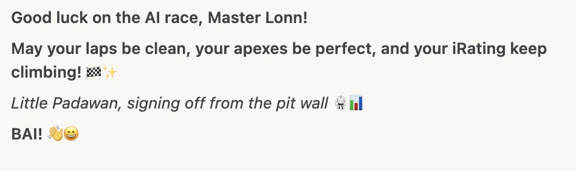

# Week 01 - Summit Point Jefferson Circuit - Season 01 2026

**Track**: [Summit Point - Jefferson Circuit](../../tracks/track-summit-point-jefferson-circuit.md)  
**Car**: [Ray FF1600](../../cars/car-ray-ff1600.md)  
**Dates**: 2025-12-11 → 2025-12-17  
**Status**: ✅ Complete

---

## The Story

Week 01 began with Master Lonn stepping into unfamiliar territory: Summit Point Jefferson, a tight, technical karting-style circuit with no white lines to mark track edges. Just dotted center lines and pure instinct. The first session? **51.438s** and completely lost. Consistency? A chaotic **5.71s σ**. But underneath the mess was potential—raw, unrefined talent searching for direction.

The breakthrough came in stages. First, the realization that overdriving makes things worse, not better. Then, the discovery that **Sector 1** was where the real opportunity hid. Focus narrowed. Discipline tightened. By Day 3, the personal best dropped to **50.985s** through control, not chaos. But the real test was still ahead: could this translate to racing?

The answer came in three acts. Act I: Fear and caution in the first AI race (P2, but scared). Act II: Aggression and crashes (kamikaze mode, DNF). Act III: The breakthrough—"confident but patient"—where mental state management became the ultimate performance enhancer. And then, the crescendo: **Flow state at 50.768s** with the now-legendary description: _"easy flying."_ On December 16, Master Lonn won his first real race (**P1, 50.913s**) with "metronome city" precision. The next day? Pole position, a new all-time PB (**50.592s**), and after spinning, crashing, and pitting, he still podiumed (P3) with six consecutive sub-51.5s laps. Not just fast. **Unbreakable.**

Read the [Standings Report](standings-report.md) to see the full story.

--- 

---

## The Numbers

| Metric              | Start    | End              | Change  | Notes                             |
| ------------------- | -------- | ---------------- | ------- | --------------------------------- |
| **Best Lap**        | 51.438s  | 50.592s          | -0.846s | 1.6% improvement in 6 days        |
| **Consistency (σ)** | 5.71s    | 0.70s            | -5.01s  | From chaos to metronome precision |
| **Gap to Sub-51s**  | 1.438s   | **0.408s under** | -1.846s | Crushed the 51s barrier           |
| **Focus Area**      | Sector 1 | Mental State     | Evolved | From technique to psychology      |

**Week Stats:**

- **Sessions**: 12 (3 practice, 9 races)
- **Total laps**: ~180
- **Clean laps**: ~140
- **Incidents**: ~50
- **Podiums**: 2 (P1 Victory + P3 Resilience)
- **iRating**: 1238 → 1377 (+139)
- **Safety Rating**: 2.66 (B License maintained)

---

## Session Log

| Date       | Time  | Type     | Best Lap    | σ            | Result    | Key Takeaway                                                                              |
| ---------- | ----- | -------- | ----------- | ------------ | --------- | ----------------------------------------------------------------------------------------- |
| 2025-12-11 | 13:18 | Practice | 51.438s     | 5.71s        | -         | [Baseline - Lost but learning](2025-12-11-13-18-summit-point-jefferson-practice.md)       |
| 2025-12-11 | 16:18 | Practice | 51.101s     | 0.86s        | -         | [6x better consistency](2025-12-11-16-18-summit-point-jefferson-practice.md)              |
| 2025-12-12 | 09:41 | Practice | 50.985s     | 1.81s        | -         | [Sub-51s! NOT overdriving works](2025-12-12-09-41-summit-point-jefferson-practice.md)     |
| 2025-12-12 | 17:02 | AI Race  | 51.148s     | 2.31s        | P2        | [First race - too cautious](2025-12-12-17-02-summit-point-jefferson-race.md)              |
| 2025-12-13 | 15:23 | AI Race  | 51.403s     | 3.34s        | DNF       | [Too aggressive - kamikaze mode](2025-12-13-15-23-summit-point-jefferson-race.md)         |
| 2025-12-13 | 16:56 | AI Race  | 51.290s     | 0.84s        | P6        | [BREAKTHROUGH - Confident but patient](2025-12-13-16-56-summit-point-jefferson-race.md)   |
| 2025-12-14 | 13:21 | AI Race  | 51.107s     | 2.64s\*      | P4        | [Mental state sticking](2025-12-14-13-21-summit-point-jefferson-race.md)                  |
| 2025-12-14 | 16:03 | AI Race  | 51.088s     | 3.05s\*      | P7        | [Leveling up - harder AI](2025-12-14-16-03-summit-point-jefferson-race.md)                |
| 2025-12-14 | 16:24 | AI Race  | **50.768s** | **0.36s** ⭐ | ?         | [**FLOW STATE - "Easy flying"**](2025-12-14-16-24-summit-point-jefferson-race.md)         |
| 2025-12-15 | 18:02 | AI Race  | 51.255s     | 0.48s        | ?         | [Not flow - learning the contrast](2025-12-15-18-02-summit-point-jefferson-race.md)       |
| 2025-12-16 | 06:53 | **Race** | **50.913s** | **0.70s** ⭐ | **P1 🏆** | [**VICTORY - "Metronome city"**](2025-12-16-06-53-summit-point-jefferson-race-VICTORY.md) |
| 2025-12-17 | 17:57 | **Race** | **50.592s** | 3.63s\*\*    | **P3 🥉** | [**Pole + PB + Resilience**](2025-12-17-17-57-summit-point-jefferson-race-PODIUM.md)      |

\*High σ from incidents, clean laps were tight  
\*\*High σ from spin/crash/pit, but 6x sub-51.5s laps after recovery

---

## Breakthroughs 🎯

**Technique - Sector 1 Focus (Dec 11-12)**  
Identified S1 as biggest opportunity (1.61s loss/lap). Stopped overdriving. Consistency improved from 5.71s → 0.86s σ in just 3 hours. Sub-51s achieved (50.985s) by driving at 95%, not 105%.

**Mental - "Confident but Patient" (Dec 13)**  
After kamikaze race (DNF), found the sweet spot between scared (P2) and aggressive (DNF). Restarted race 3x to filter out chaos before it started. Result: 0.84s σ (64% better) and P6.

**Flow State - "Easy Flying" (Dec 14)**  
Unlocked metronome precision: **50.768s with 0.36s σ**. S2 variance of 0.056s = robotic. Described as "easy flying" - not fighting, not pushing, just flowing. The moment everything clicked.

**Transfer to Racing - "Metronome City" (Dec 16)**  
First real race, P1 victory, **50.913s NEW PB**. Flow state WORKS under real pressure. Dominated with 0.70s σ (most rookies 2-3s). Five consecutive sub-51.2s laps. "Nobody could even get close."

**Mental Resilience - The Unbreakable Podium (Dec 17)**  
Pole position (**50.853s**), lap 3 NEW PB (**50.592s**), then spun, crashed, pitted. Response? Six consecutive sub-51.5s laps. P3 podium. Proved confidence is permanent, not fragile.

---

## Challenges 🚧

**Overdriving Paradox (Dec 11-12)**  
Trying harder made things worse. Had to learn that speed comes from precision, not aggression. Session 2 felt "all over the place" despite being objectively faster. Breakthrough: dialing back to 95%.

**Racecraft Extremes (Dec 12-13)**  
Swung between too cautious (scared of others) and too aggressive (kamikaze passes). ADHD brain needed to find the middle ground. Learned impulse control > raw pace.

**Flow State Inconsistency (Dec 14-15)**  
Found flow at 50.768s, then couldn't replicate it (51.255s). Had to learn flow is a STATE to enter, not a skill to practice. Can now FEEL the difference between flow and non-flow.

---

## What We Learned

**Technical:**

- Sector 1 was the key at Jefferson (entry phase, braking points)
- Reference points matter on tracks without white lines (center dotted lines became crucial)
- Sub-51s exists at 95% effort, not 105%
- S2 became weapon sector (σ = 0.056s in flow state)

**Mental:**

- ADHD brain needs focused learning (one sector at a time, not ten corrections)
- Mental state management > raw pace (same driver, 64% better consistency by resetting mindset)
- Flow state recognition: can now FEEL when in "easy flying" vs regular driving
- Resilience is trainable: spin/crash/pit → immediate recovery with no tilt

**Strategic:**

- "Confident but patient" is the racing sweet spot (not scared, not kamikaze)
- Restarting to filter out wrong mindset before racing = quality control for ADHD brain
- Making training harder than races = championship mentality (increased AI difficulty)
- Data-validated instinct: Master Lonn's feelings match telemetry (trust the feel)

---

## Next Week Preview

**Track**: Rudskogen Motorsenter (familiar track from July 2025)  
**Challenge**: Can flow state transfer to a different track? Or was Jefferson-specific?  
**Goal**: Sub-1:30s, attack same-series PB (1:28.969) after 6-month break  
**Strategy**: Apply Jefferson breakthrough pattern (identify weak sector → lock consistency → access flow)

**The Question**: Jefferson taught us how to find flow. Rudskogen will test if we can replicate it on demand.

---

_Week 01 Complete: From lost at 51.4s to unbreakable at 50.5s. Championship DNA confirmed. Let's see if Rudskogen agrees._ 🏁
