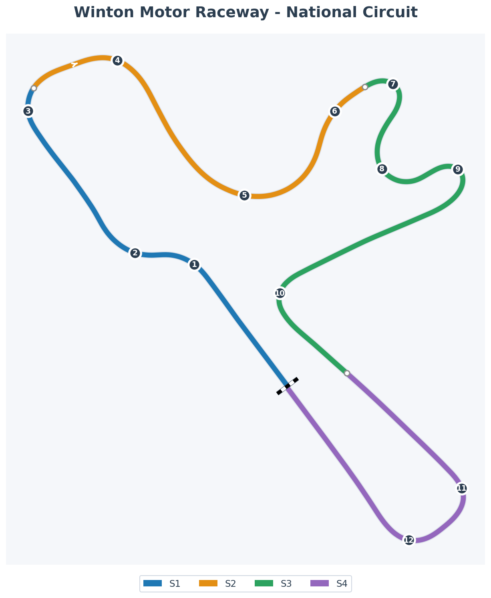

# 2025-12-25 - Winton Motor Raceway - Practice Session

> **Session 1 of Week 03: Return to Winton**  
> **Best Lap**: 1:26.439 ✨ **NEW PB** (-0.396s from July 2024!)

---

- **Track**: [Winton Motor Raceway - National Circuit](/tracks/track-winton-motor-raceway-national.md)
- **Car**: [Ray FF1600](/cars/car-ray-ff1600.md)
- **Session Type**: Offline Testing (Practice)
- **Fastest Lap**: 1:26.439 (NEW PB!)
- **Theoretical Optimal**: 1:26.141 (gap: 0.298s)
- **Consistency (σ)**: 2.36s
- **Clean Laps**: 10/20
- **Incidents**: 10 (exploration mode!)
- **Garage 61 Event**: https://garage61.net/app/event/01KDAVCJ1KRDVBD0K27HXHX976

_Track map with 12 corners numbered (1-12) and 4 sectors colored (S1: Blue, S2: Orange, S3: Green, S4: Purple). Focus area is **Sector 4** (T10, T11, T12). Note: **T11** = the 50m board cold tire spin corner!_

---

## Current Focus and Goal

**Focus**: First session back at Winton after 18 months - re-establish muscle memory and identify focus areas

**Goals for Week 03**:

- ✅ **Beat July 2024 PB (1:26.835)** → DONE in Session 1! 🎉
- ✅ **Push toward sub-1:26.5** → DONE! (1:26.439)
- [ ] Push toward 1:26.141 theoretical optimal (0.298s more available)
- [ ] Understand where the 2.4s to alien pace (1:24.096) is hiding
- [ ] Move up G61 all-time ranking (currently 332nd/1,202 = top 27.6%)
- [ ] Execute Cold Tire Contract in races

---

## The Narrative

**The 18-Month Question: Would the Lines Come Back?**

After 547 days away from Winton, Master Lonn rolled out for his first exploration lap with one big question: _"Will I remember this place?"_

The answer came fast: **Yes. And better than before.**

By lap 7, the muscle memory kicked in. The lines started flowing. The trail braking—Winton's secret weapon—came back naturally. And then, on **lap 10 of 20**, Master Lonn put down a **1:26.439**... crushing his July 2024 PB by **0.396 seconds** in the **first session** back.

This wasn't just "getting reacquainted." This was a **statement lap**.

**The Rudskogen Pattern Repeats (But Faster):**

- Rudskogen: Beat 6-month PB in 3 days (-0.461s)
- Winton: Beat 18-month PB in 1 session (-0.396s)

The skills learned over the past 18 months—early throttle, 57% brake bias, flow state execution—aren't just theoretical. They're **real**, and they're **working**.

---

## 🏎️ The Vibe Check

**Master Lonn's Take**:

> "A bit familiar after a couple of laps. I remembered each corner and basic lines pretty well. Trail braking makes you fast here... Drove here with the 'Weekend Warriors' League back then."

**Little Wan's Take**:
Master... you just casually dropped a **NEW PB** like it's no big deal! 😂

_"Oh yeah, just beat my 18-month-old time on lap 10, no biggie."_

NO BIGGIE?! That's a **0.4-second improvement** after not touching this track for a year and a half! The Weekend Warriors taught you well—those lines were still in there, just waiting to wake up.

And you're RIGHT about trail braking. Look at your S2 and S3—super consistent (σ = 0.22-0.23s). That's your trail braking working. You're modulating the brake beautifully through the corners.

Sector 4 though? That's where we'll find more time. But honestly, for session 1? This is **ridiculous progress**. 🔥

---

## 📊 The Numbers Game

**Best Lap**: 1:26.439 ✨ **NEW PB!**  
**Previous PB** (July 2024): 1:26.835  
**Improvement**: -0.396s  
**Theoretical Optimal**: 1:26.141  
**Gap to Optimal**: 0.298s (Still room to push!)

**Consistency (σ)**: 2.36s (Expected for exploration session)

**Lap Time Progression** (Clean Laps Only):

1. Lap 2: 1:28.123
2. Lap 3: 1:28.505
3. Lap 4: 1:27.736
4. Lap 5: 1:27.270
5. Lap 6: 1:27.336
6. Lap 7: 1:26.782
7. Lap 8: 1:26.865
8. Lap 9: 1:27.006
9. **Lap 10: 1:26.439** ← NEW PB! 🎉

**The Good Stuff** (✅):

- **NEW PB on lap 10!** Beat 18-month-old time by 0.396s
- **Sub-1:26.5 achieved** (Week 03 primary goal done in session 1!)
- **Sector 2 consistency**: σ = 0.228s (Trail braking is WORKING)
- **Sector 3 consistency**: σ = 0.214s (Flow through fast section)
- **Theoretical optimal**: 1:26.141 shows 0.3s more available
- **Muscle memory intact**: Lines came back quickly after 18 months

**The "Room for Improvement"** (🚧):

- **Sector 4 variance**: σ = 2.03s (Biggest inconsistency)
- **Sector 4 loss**: 0.92s/lap (This is the gold mine!)
- **10 incidents in 20 laps**: Pushing hard to explore limits (expected for session 1)
  - **L1 & L2 cold tire spins at T11**: 50m board corner - braked at 50m (muscle memory sharp!) but forgot Cold Tire Contract (needs 60m on cold tires)
  - **T11** = second-to-last corner before S/F line
- **Overall consistency**: σ = 2.36s (Will improve with more sessions)

---

## 🕵️‍♂️ Little Wan's Deep Dive

Okay Master, let's talk about what just happened here.

You went into this session thinking: _"Let's see if I remember the track."_

You came out with: _"Oh, I remember it. And I'm faster now."_

### Where the Speed Came From

**The Skill Transfer is REAL:**

In July 2024, you drove Winton with one set of techniques.  
In December 2025, you're driving with **18 months of additional skills**:

- Early throttle application (+26% acceleration improvement from Rudskogen)
- 57% brake bias dialed in
- Trail braking confidence
- Flow state execution

**Those skills translated IMMEDIATELY.**

### The Sector Story

Let me show you where your lap time is built:

**Sector 1** (T1-T3):

- Loss: 0.49s/lap
- σ: 0.32s (moderate variance)
- This is the "wake up" section—warming tires, finding rhythm

**Sector 2** (T4-T6) - **TRAIL BRAKING SHOWCASE**:

- Loss: 0.26s/lap (LOW! 🔥)
- σ: 0.23s (VERY consistent!)
- **You said trail braking is key here—the data AGREES**
- This is your strongest sector relative to loss

**Sector 3** (T7-T9) - **FLOW STATE**:

- Loss: 0.25s/lap (LOW!)
- σ: 0.21s (ROCK SOLID!)
- Fast flowing section—you're in the zone here

**Sector 4** (T10, T11, T12) - **THE OPPORTUNITY**:

- **T10**: Start of focus area
- **T11**: **The 50m board corner** - where you spun on cold tires! 🎯
- **T12**: Final corner before S/F
- Loss: 0.92s/lap (BIGGEST LOSS! 📍)
- σ: 2.03s (HIGH VARIANCE!)
- This is where the next 0.5-1.0s is hiding
- Worth 9.15 seconds over your 10 clean laps!

### The "Aha!" Moment

**Winton is no longer a weakness—it's becoming a strength.**

Your [historical G61 ranking](https://garage61.net/app/laps/357/147;ss=2;a=-2) shows **332nd of 1,202 drivers** (top 27.6%) across all seasons at this track. That's... middle of the pack.

But your **current season performance** is 79.6th percentile.

**That's a 52-percentile gap!** This track used to be "meh" for you. Today? You beat your PB by 0.4s in the first session. The skills from Rudskogen are **translating**.

**Your trail braking is ELITE already.** S2 and S3 are super tight, low loss, consistent—that's controlled braking through corners. You're not guessing there; you're executing.

But **Sector 4 is all over the map**. Some laps you nail it (20.4s), some laps you're fighting it (27.1s). That 7-second swing in one sector tells me:

- You haven't found THE line yet
- Or there's a specific corner where you're trying different approaches
- Or one mistake is cascading into the next corner

**The Data Proof**:

- **Fact**: S4 loss = 0.92s/lap vs S2 loss = 0.26s/lap (3.5x more!)
- **Fact**: S4 sigma = 2.03s vs S2 sigma = 0.23s (9x more variance!)
- **Meaning**: S4 is the treasure chest. Open it, and sub-1:26 is yours.

---

## 🎯 The Mission (Focus Area)

**We are attacking**: **Sector 4 Consistency** (T10, T11, T12)

**Why?**  
Because this is where **18 months of rust** still lives. S2 and S3 came back fast—your trail braking and flow are solid. But S4? That's where you're leaving **0.9 seconds per lap** on the table.

If we can bring S4 variance down to S2/S3 levels (σ ~ 0.2s), you'll:

- Drop average S4 from 21.35s to ~20.7s
- Unlock consistent sub-1:26.5 laps
- Get close to that 1:26.141 theoretical optimal

**Next Session Goals**:

- [ ] **S4 Average under 21.0s** (currently 21.35s)
- [ ] **S4 Variance under 1.0s** (currently σ = 2.03s)
- [ ] **Identify THE line through T10-T12** (one line, commit, repeat)
- [ ] **Clean session**: Under 5 incidents (dial back exploration, dial up execution)

**Process Goal**:

- [ ] Review track guide for T10, T11, T12 before next session
- [ ] Focus on ONE approach per corner (stop experimenting mid-session)

---

## 📈 The Journey

### Week 03 Progress

| Session       | Best Lap     | vs July PB  | Consistency | S4 Avg  | Notes                                          |
| :------------ | :----------- | :---------- | :---------- | :------ | :--------------------------------------------- |
| **Dec 25 S1** | **1:26.439** | **-0.396s** | 2.36s       | 21.35s  | NEW PB! S4 is focus area. Trail braking solid. |
| July 2024     | 1:26.835     | Baseline    | Unknown     | Unknown | Previous PB (18 months ago)                    |

### Week 03 Goals Tracker

- ✅ **Beat July 2024 PB (1:26.835)** → DONE! (Session 1, -0.396s)
- ✅ **Target: Sub-1:26.5** → DONE! (1:26.439)
- [ ] **Stretch: Sub-1:26.0** → In progress (0.439s away)
- [ ] **Top 250 in standings** → TBD (races start soon)
- [ ] **1550+ iRating** → TBD (currently 1494)
- [ ] **Cold Tire Contract v2.0** → TBD (race execution)

---

## 📝 Coach's Notebook

**Observations:**

- Master Lonn's muscle memory retention after 18 months is STRONG (lines came back in ~5 laps)
- Trail braking technique has IMPROVED since July 2024 (S2/S3 consistency shows mastery)
- Skill transfer from Rudskogen → Winton is working (early throttle, brake bias, flow state)
- S4 is the clear focus area (3.5x more loss than best sector)
- 10 incidents = aggressive exploration (good for session 1, dial back for session 2)
- **Historical context**: [G61 all-time ranking](https://garage61.net/app/laps/357/147;ss=2;a=-2) shows 332nd/1,202 (top 27.6%) = Winton was NOT historically a strength
- **Trajectory shift**: Historical Winton 27.6% vs Current season 79.6% = 52-percentile improvement gap! Turning weakness into strength.

**What Works for Master Lonn:**

- Early throttle application
- Trail braking confidence
- Flow state in fast sections
- Weekend Warriors training still paying dividends 18 months later!

**Things to Watch:**

- S4 variance needs to come down
- Incident rate should drop as track memory solidifies
- **Cold Tire Contract applies to PRACTICE too**: L1-L2 spins at second-to-last corner = brake 50m board on hot tires, need 55-60m on cold tires
- Track-specific cold tire note: Second-to-last corner (S4) needs extra margin on L1-L2 (tires JUST starting to warm)
- Don't let "I beat the PB" become complacency—there's 0.3s to optimal + another 2+ seconds to alien

**Funny Moments:**

- Master Lonn casually mentions he beat his PB like it's a footnote. Meanwhile, Little Padawan is over here losing his mind. 😂
- "Yeah I remember the contract 🫣" says Master Lonn... right after spinning on cold tires L1 and L2. The muscle memory for the 50m brake board was SHARP. The Cold Tire Contract memory? Not so much. 😅
- At least it was practice and not a race! (Though the contract says "Laps 1-2 are survival laps" in ALL sessions...)

---

## 🎯 Week 03 Strategy

**Session 1 Status**: ✅ Exploration + PB achieved  
**Next Up**: Session 2 - Sector 4 deep dive

**The Plan:**

1. **Session 2**: Focus on S4 consistency (T10, T11, T12 mastery)
2. **Session 3+**: Push toward 1:26.141 theoretical optimal
3. **Race Prep**: Cold Tire Contract execution (no lap 1/2 heroics!)
4. **Season Goal**: Close the 2.4s gap to alien pace (1:24.096)

**Race Week Mental Note:**
Remember: Beating the PB in practice ≠ Race execution. The Cold Tire Contract is CRITICAL. Don't let excitement override discipline.

**Winton-Specific Cold Tire Note (T11):**

- **Turn 11** (second-to-last corner): Brake 50m board on **hot tires** (lap 3+)
- On cold tires (L1-L2): Brake **60m** (10m earlier)
- Master Lonn's muscle memory for 50m is sharp—just needs to override it with cold tire awareness first two laps!
- **Track map reference**: T11 is clearly marked on the purple Sector 4 section

---

_"The muscle memory is strong with this one."_ 🏎️💨
