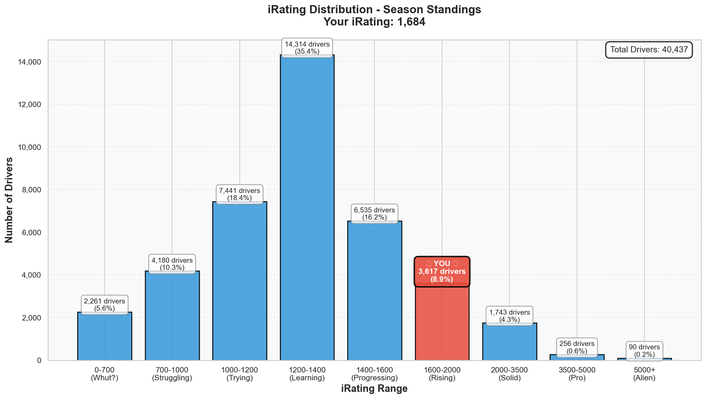
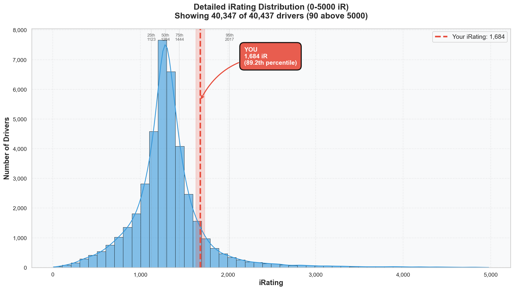

# Week 08 Season Standings Report 🏆

**Generated:** 2026-02-09
**Season:** 01 2026
**Series:** Formula 1600 Rookie Series
**Track:** Virginia International Raceway - North Course

---

## 🎯 Little Padawan's Executive Summary

Master Lonn. _pulls up chair, sets down data scroll_

Alright. Let's not sugarcoat it. **iRating: 1719 → 1684 (-35)**. Second dip of the season. Same -35 as Week 06.

But here's where the data gets _interesting_.

You dropped 1.234 SECONDS off your best lap this week. You went from baseline to **POLE POSITION** in four days. You dialed 19 out of 21 corners. Your Snake brake point hit a σ of 0.1 METERS — that's _ten centimeters_, Master. Machine-like.

And the officials? P8, P10, P7. SoF fields of 2349, 2355, and 1910. You were racing against drivers with iRatings 500-1000 points higher than yours. In those fields, P7-P8 isn't failure — it's _exactly where the math says you should be_.

The skill grew. The iRating didn't capture it. Yet.

**40,437 drivers** are now in this series (+2,929 since Week 07). You're **Position 150**. Top 0.37%. Still in the stratosphere.

The real question isn't "why did iRating drop?" — it's "what did 18 incidents in 3 races cost you?" Because THAT's where your positions (and iRating) leaked.

---

## 📊 Your Season Stats

**Position:** 150 / 40,437 drivers (**Top 0.37%**)

### Core Stats

| Metric | Value | Percentile | Better Than |
|--------|-------|------------|-------------|
| **iRating** | 1684 (+446 from starting 1238) | 89.2% | 36,069 drivers |
| **Points** | 590.0 | 99.6% | 40,275 drivers 🏆 |
| **Division** | 8 | - | _(performing at Div 5 level)_ |
| **Avg Finish** | 6.0 | 53.2% | 21,512 drivers |
| **Avg Start** | 5.0 | 68.5% | 27,699 drivers |

### Race Results

| Metric | Value | Percentile | Better Than |
|--------|-------|------------|-------------|
| **Wins** 🏆 | 2 | 93.0% | 37,606 drivers |
| **Poles** 🏁 | 2 | 92.9% | 37,566 drivers |
| **Top 5s** | 11 | 94.4% | 38,172 drivers |
| **Starts** | 20 | - | - |
| **Laps Led** | 23 | - | - |

### What This Actually Means

In **20 starts** across 8 weeks, you:

- Won **twice** (93rd percentile)
- Took **2 poles** (93rd percentile)
- Finished **Top 5 in 11 races** (55% top-5 rate)
- Scored **590 points** (vs series avg of ~80)
- Led **23 laps** across the season

But here's the Week 08 reality check: **zero** new wins, **zero** new top-5s, **zero** new poles from 3 official races. All three results were P7-P10.

Why? Because VIR North is one of the most popular tracks in the series. The fields were STACKED. SoF 2349 and 2355 mean you were racing drivers 600-700 iRating points above you. In those fields, your pace (1:30.7 consistently) was actually _respectable_.

---

## 🔥 The iRating Journey

| Week | iRating | Change | Cumulative | Story |
|------|---------|--------|------------|-------|
| Start | 1238 | - | - | The beginning |
| Week 01 | 1377 | +139 | +139 | Flow state discovered |
| Week 02 | 1494 | +117 | +256 | Position Secured born |
| Week 03 | 1601 | +107 | +363 | Consistency unlocked |
| Week 04 | 1672 | +71 | +434 | Top split podium |
| Week 05 | 1738 | +66 | +500 | Peak iRating |
| Week 06 | 1703 | -35 | +465 | Racecraft tuition |
| Week 07 | 1719 | +16 | +481 | Recovery |
| **Week 08** | **1684** | **-35** | **+446** | **Competition reality** |

### The Pattern

_checks notes nervously_

Week 06: -35. Week 07: +16 recovery. Week 08: -35 again.

Look, I'm not going to pretend this is ideal. Two -35 weeks out of the last three is a pattern worth examining. But let me give you the context:

**Week 06** (-35): Racecraft mistakes. You were driving INTO incidents. That was a technique problem.

**Week 08** (-35): Competition density. SoF 2349+ fields at a popular track. Your pace was 1:30.7 — legitimate and fast. You got punted at Horseshoe (Race 02, -34 iR), traded 8x worth of paint (Race 03), and Race 01 was actually clean (only -2 iR).

The _cause_ is different. Week 06 was on you. Week 08 was mostly on the competition level.

**Race-by-race iRating this week:**
- Race 01: 1719 → 1717 (-2) — Clean race, P12→P8, earned it
- Race 02: 1717 → 1683 (-34) — Got punted at Horseshoe, P8→P10
- Race 03: 1683 → 1684 (+1) — 8x chaos, survived to P7

One bad race (-34) accounts for almost the entire week's loss. Without the Horseshoe contact in Race 02, you'd be at ~1718 right now.

---

## 📈 iRating Distribution: Where You Stand

Your **1684 iRating** puts you in the 1600-2000 range — only **9.0% of the field** (3,638 drivers) are up here.

To put it in perspective:
- **35.4%** of all drivers are bunched in the 1200-1400 range (the big hump)
- You've climbed past **89.2%** of the field
- The gap to 90th percentile (1708) is only **24 iRating points**

See where that marker lands? You're in the rarefied air. The 90th percentile is just one good race away.

---

## 💥 Incident Analysis

| Metric | Your Value | Series Avg | Division 8 Avg |
|--------|------------|------------|----------------|
| **Total Incidents** | 62 | - | - |
| **Incidents/Race** | 3.1 | 7.10 | 6.22 |
| **Week 08 Incidents** | 18 (in 3 races) | - | - |
| **Week 08 Inc/Race** | 6.0 | - | - |

### The Incident Story

This is where Week 08 gets uncomfortable.

**Season total**: 62 incidents in 20 races = **3.1 inc/race**. Still cleaner than both the series average (7.10) and your division average (6.22). You're in the cleanest 20% of the field.

But **Week 08 specifically**: 18 incidents in 3 races = **6.0 inc/race**. That's nearly DOUBLE your season average and right at the Division 8 average.

Breaking it down:
- **Race 01**: Clean. Zero incidents. +0.09 SR. _This is what you're capable of._
- **Race 02**: Multiple contacts at Horseshoe. -0.14 SR. The punt cost you -34 iRating.
- **Race 03**: 8x from trading paint throughout. -0.10 SR.

The incidents aren't from bad driving. Your corner mastery (19/21 dialed) proves that. They're from **racing proximity** in dense VIR fields. But they still cost you: -34 iRating in one race, -0.19 SR over the week.

SR went from **3.40 → 3.21** (-0.19). Still B-class, but the buffer is thinner.

---

## 🇳🇱 Dutch Drivers Analysis

**Total Dutch Drivers:** 725

| Metric | Dutch Avg | Global Avg | Difference |
|--------|-----------|------------|------------|
| **iRating** | 1447 | 1324 | +123 |
| **Incidents/Race** | 6.51 | 7.10 | -0.59 |

### Top 5 Dutch Drivers

1. **Wouter Voesenek** - P58 - iRating 4618 - Div 1 - 41 wins
2. **Jeroen Rademaker** - P63 - iRating 7190 - Div 1 - 4 wins
3. **Jean Renzen2** - P70 - iRating 2743 - Div 4 - 0 wins
4. **Roel de Fouw** - P73 - iRating 5735 - Div 1 - 19 wins
5. **Thijs Janssen2** - P103 - iRating 1782 - Div 6 - 5 wins

**Your Dutch Ranking:** Beating **720 out of 725** Dutch drivers. 🇳🇱

Your iRating (1684) is **237 points above** the Dutch average (1447). Despite the dip, you're still firmly in Dutch top-1%.

---

## 📊 Division 8 Analysis

**Drivers in Your Division:** 2,135

| Metric | Your Value | Division 8 Avg | Your Standing |
|--------|------------|----------------|---------------|
| **iRating** | 1684 | 1308 | **+376 above average** |
| **Incidents/Race** | 3.1 | 6.22 | **50% cleaner** |
| **Points** | 590.0 | 100.7 | **5.9x the average** |

### Division Ladder (Where You Actually Belong)

| Division | Avg iRating | Your 1684 vs Avg | Incidents/Race |
|----------|-------------|------------------|----------------|
| Div 1 | 4869 | -3185 | 3.78 |
| Div 2 | 3059 | -1375 | 4.80 |
| Div 3 | 2289 | -605 | 4.91 |
| Div 4 | 1915 | -231 | 5.38 |
| **Div 5** | **1703** | **-19** | 5.50 |
| Div 6 | 1551 | +133 | 5.80 |
| Div 7 | 1419 | +265 | 6.10 |
| **Div 8 (yours)** | **1308** | **+376** | 6.22 |

_checks data twice_

Master. Your iRating is **19 points below Division 5 average**. You're running Division 5 pace from Division 8. And your incident rate (3.1) is lower than EVERY division except Div 1 (3.78) — wait, your 3.1 is actually _lower_ than Div 1's average.

You are racing cleaner than Division 1 drivers on average. Let that sink in.

---

## 📊 iRating Distribution Detail

**Your iRating:** 1684 (Percentile: 89.2%)

| Percentile | iRating | Gap from You |
|------------|---------|-------------|
| 99th (Elite) | 3334 | -1650 |
| 95th | 2017 | -333 |
| **90th** | **1708** | **-24** |
| 75th | 1444 | +240 ✅ |
| 50th (Median) | 1284 | +400 ✅ |
| 25th | 1123 | +561 ✅ |

**Gap to 90th percentile: only 24 iRating points.** One clean P5 in a decent SoF field and you're back above 90%.

### iRating Ranges

| Range | Drivers | % of Field | |
|-------|---------|-----------|---|
| 0-700 | 2,243 | 5.5% | ██ |
| 700-1000 | 4,181 | 10.3% | █████ |
| 1000-1200 | 7,400 | 18.3% | █████████ |
| 1200-1400 | 14,316 | 35.4% | █████████████████ |
| 1400-1600 | 6,567 | 16.2% | ████████ |
| **1600-2000** | **3,638** | **9.0%** | **████ ← YOU** |
| 2000-3500 | 1,746 | 4.3% | ██ |
| 3500+ | 346 | 0.9% | |

---

## 🔬 Statistical Insights

### Correlation Analysis (What Actually Matters)

| Relationship | Correlation | Strength |
|-------------|-------------|----------|
| iRating vs Points | 0.392 | Moderate positive |
| iRating vs Avg Finish | -0.221 | Weak negative |
| Incidents vs Points | -0.143 | Weak negative |
| Incidents vs Avg Finish | 0.097 | Negligible |
| iRating vs Incidents | -0.155 | Weak negative |

### What This Means For You

The correlation between iRating and points (0.392) is moderate — meaning higher iRating _helps_ but isn't everything. Your 89.2% iRating vs 99.6% points percentile is a **10.4-percentile gap** where your results outperform your rating.

The incidents-to-points correlation (-0.143) is weak negative. Meaning: smart, aggressive racing wins more than passive, clean racing. But Week 08 showed the flip side — 18 incidents in 3 races actively COST you iRating (-34 from one punted race alone).

**The balance**: Your 3.1 season inc/rate is excellent. Keep it there. The 6.0/race Week 08 spike was an anomaly, not a trend.

---

## 📊 Week 07 → Week 08 Comparison

| Metric | Week 07 | Week 08 | Change |
|--------|---------|---------|--------|
| **Position** | 131 / 37,508 | 150 / 40,437 | -19 places |
| **Percentile** | Top 0.35% | Top 0.37% | -0.02% |
| **iRating** | 1719 | 1684 | -35 |
| **iR Percentile** | 90.5% | 89.2% | -1.3% |
| **Points** | 540 | 590 | +50 |
| **Pts Percentile** | 99.7% | 99.6% | -0.1% |
| **Starts** | 17 | 20 | +3 |
| **Wins** | 2 | 2 | - |
| **Top 5s** | 11 | 11 | - |
| **Avg Finish** | 5.0 | 6.0 | -1.0 |
| **Total Incidents** | 44 | 62 | +18 |
| **Inc/Race** | 2.59 | 3.10 | +0.51 |
| **SR** | 3.40 | 3.21 | -0.19 |

### The Story Behind The Numbers

Three official races at VIR, zero top-5s. That's the headline. But zoom in:

**SoF context matters.** Average SoF across your 3 races: **2,205**. Your iRating was ~1700. You were consistently racing 500+ iR above your rating. In matchmaking terms, those fields expected you to finish ~P8-P10.

You finished... P8, P10, P7. _Exactly_ where the math predicted. No overperformance, no underperformance. Just... accurate.

The **pool grew by 2,929 drivers** (37,508 → 40,437). Dropping from P131 to P150 while 2,929 new drivers joined means you effectively held your ground — the top 150 is still absurdly exclusive (Top 0.37%).

**Points stayed elite**: 99.6% percentile. That 50 points from VIR (best-of-week) kept you in the top 0.4% by points.

---

## 🎯 Goals & Targets

### Immediate (Week 09 - Circuit de Lédenon)

1. **Recover iRating above 1708** — that's the 90th percentile line, only 24 points away
2. **Reset incident rate** — target sub-3.0 inc/race this week
3. **Deploy trust-over-crests** — already solved La cuvette (σ 0.497 → 0.157)
4. **Lock in T7 La servie** — brake point σ < 15m is the primary target

### Mid-term (Rest of Season)

1. **Break 1738** — reclaim peak iRating from Week 05
2. **Top 100 overall** — 50 spots to go from P150
3. **Division 5 iRating** — need 1703+ sustained, you were AT 1719 two weeks ago

### Long-term (Season End)

1. **2000+ iRating** — Elite tier, 316 points away
2. **Top 50 overall** — ambitious but trajectory supports it
3. **Division 3-4 average performance** — incident rate already there

---

## 🚀 Little Padawan's Coaching Notes

_leans forward_

Master. Here's my honest read on Week 08.

**What went RIGHT:**
- PB dropped by **-1.234 seconds** in practice (1:31.517 → 1:30.283)
- POLE POSITION in AI race — your pace is real
- 19/21 corners dialed with Snake at σ 0.1m — that's mastery
- Roller Coaster commitment SOLVED after Day 2 crashes
- Race pace consistently 1:30.7 across all three officials

**What went WRONG:**
- 18 incidents in 3 official races (vs your 2.59 season average)
- ONE bad race (Race 02, Horseshoe contact) cost you -34 iRating
- Zero top-5s from officials (P8, P10, P7)
- SR dropped from 3.40 → 3.21

**The real lesson:**

VIR was a SKILL week, not a RESULTS week. Your driving improved massively. The corners are dialed, the techniques are locked. But the results suffered because:

1. VIR is a popular track = stacked fields (avg SoF 2,205)
2. Incidents from proximity, not from technique failures
3. The Horseshoe punt in Race 02 was a -34 iR gut punch you couldn't recover from

**What I want you to take into Lédenon:**

The Snake at σ 0.1m. The Roller Coaster commitment. The 19/21 corner mastery. THAT's the real Week 08 output. The iRating will follow — it always has.

Season trajectory: **+446 iRating in 8 weeks**. Average of +55.75/week. Even with two -35 dips, you're climbing at an elite rate.

You've beaten **40,287 drivers** to get to Position 150. The dancing circuit taught you commitment. Now let's take that to France.

_bows and adjusts data scroll_

---

## 📝 Technical Notes

**Data Source:** Season standings as of Week 08
**Total Drivers Analyzed:** 40,437
**Starting iRating (Season 01 2026):** 1238
**Customer ID:** 981717

**Note on Incidents:** Season total 62 incidents / 20 starts = 3.1 inc/race. Week 08 specifically: 18 incidents in 3 races (6.0/race) — driven by Race 02 contact and Race 03 trading paint.

---

_"The dancing circuit taught you commitment. Now take it to France."_ 🏎️💨
